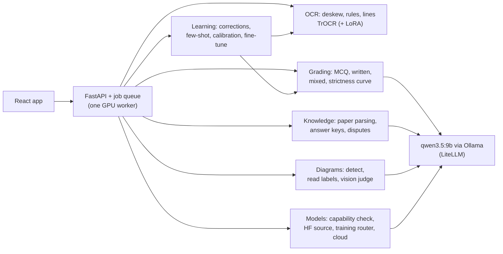

# GradeForge: local AI exam grading

GradeForge reads students' handwritten answer sheets, grades them against the teacher's answer
key with a local AI model, and learns from the teacher's corrections. It handles MCQs, written
answers, "choose the option and justify" questions and labelled diagrams.

**Student data never leaves the computer.** OCR, grading and learning run locally on one
8 GB laptop GPU (TrOCR, MiniLM and `qwen3.5:9b` through Ollama). Cloud models are opt-in and
blocked without explicit consent.

## What a teacher does

1. **Upload the question paper** (PDF or photo). Questions, marks, MCQ options and sub-parts
   are detected; numbered instructions are skipped.
2. **Get an answer key.** The AI drafts one, or the teacher writes it. The AI then checks the
   teacher's key (MCQs are solved blind, so it isn't anchored to the teacher's choice).
   Disagreements open a dispute: accept, argue, or keep your answer. Every decision is logged.
3. **Upload answer sheets.** Handwriting is read line by line, drawings are detected, and each
   line and drawing is matched to its question.
4. **Grade.** Every mark comes with feedback and, when something is uncertain, a plain reason
   to check it. A strictness slider (0-100) re-scores instantly without re-running any model.
5. **Correct.** Fix a misread line or change a mark. Corrections are kept as the teacher's
   intent and improve future grading.

Try it without preparing files: **Exams → Load demo exam** creates a Biology test with a
finalized key and three students (strong, weak, and one who skipped the diagram).

## How it learns

| # | Mechanism | Works with | Starts after |
|---|---|---|---|
| 1 | Past corrections of similar answers are shown to the AI as examples | every model, cloud included | 1 correction |
| 2 | Isotonic calibration of each model's bias against the teacher, per subject | every model | 15 corrections |
| 3 | LoRA fine-tuning of TrOCR on corrected lines; used only if held-out error drops | the handwriting reader | 20 lines |
| 4 | A Colab/Kaggle notebook that fine-tunes the grading model (an 8 GB GPU can't); the result is imported back into Ollama | models the training router can place (e.g. Gemma 4 E4B) | 200 recommended |

## Choosing a model

Any model Ollama serves can grade. There is no list of supported models:

1. **Identify** it from Ollama's own metadata (architecture, size, context) and measure its real VRAM.
2. **Check it** (~30 s) before it grades: JSON output, following instructions, marking a known
   answer (full / partial / wrong), reading an image, and finding one fact in a long text. A model
   that fails a required check can't be selected.
3. **Find its training source** on HuggingFace (only the model's name is sent), matched on the exact
   parameter count, with quantised re-uploads and third-party finetunes ranked down. "Not right?"
   lets the teacher pick the repo instead.
4. **Gate** on the installed libraries (transformers knows the architecture, Ollama already runs it
   as GGUF), then **route** training: this GPU, free Colab/Kaggle, or nowhere, with the reason.

Each model gets a tier: 🟢 trainable (and where), 🟡 inference-only (few-shot + calibration still
learn), or 🔴 incompatible. A small [override registry](registry/overrides.json) patches the few
things auto-resolution can't know, such as "don't QLoRA-train Qwen 3.5".

Cloud models (OpenAI, Anthropic, Gemini) are optional: your own API key, kept in Windows Credential
Manager; a cost estimate before use; and grading only switches to the cloud after an explicit consent tick.

## Measured on this build (RTX 4060 Laptop, 8 GB)

| What | Result |
|---|---|
| `qwen3.5:9b` VRAM @ 8K context | 5.24 GiB, 100 % on GPU (16K context spills to CPU) |
| TrOCR + MiniLM + `qwen3.5:9b` together | 7.38 of 8.19 GB, all on GPU |
| One written answer graded (thinking off) | ~3 s (thinking on: ~55 s, same result) |
| Full 6-question sheet: read + graded | ~8 s OCR + ~13 s grading |
| Answer key for 6 questions | ~29 s, all correct in the test paper |
| OCR on synthetic handwriting-font pages | 0-2 % character error rate |
| TrOCR fine-tune on a difficult (simulated) writer | held-out CER 23.1 % → 1.5 %; unseen words 11.7 % → 0.8 %; ~22 s |
| Diagram scoring (complete / one label / wrong diagram) | 4/4, 2.5/4, 0/4 |
| Capability check, `qwen3.5:9b` | 5/5 passed in ~29 s; marks the known answers 5.0 / 2.0 / 0.0 of 5 |
| Capability check, `gemma4:e4b` | grading checks pass; **fails vision**: Ollama lists "vision", but the model replies it can't see the image, so diagrams skip its visual judgement |
| HuggingFace source found | `qwen3.5:9b` → `Qwen/Qwen3.5-9B`, `gemma4:e4b` → `google/gemma-4-E4B-it` (parameter counts match Ollama's), ~1 s |
| Training route on this laptop | Gemma 4 E4B: QLoRA ~10 GB → Colab/Kaggle. Qwen 3.5 9B: LoRA ~22 GB → inference-only |

These are synthetic test pages. Real handwriting will be harder, and that is the main thing
still to validate (see *Limitations*).

## Architecture



`src/ocr`, `src/grading`, `src/diagram` and `src/learning` cannot import network libraries,
and `tests/test_privacy_boundary.py` enforces it. Models reach them only as injected functions.

## Setup (Windows, PowerShell)

Everything (venv, pip cache, temp files, model weights, Node) stays inside the project
folder; `env.ps1` redirects every cache away from `C:`.

| Needs | Version |
|---|---|
| Python | **3.14.0** (not 3.14.1, which torchvision 0.29 excludes) |
| NVIDIA driver | CUDA 13.2+ (no CUDA toolkit needed) |
| Ollama | 0.34+ |
| Node | ≥ 22.22: the official portable zip unpacked to `tools\node` |

```bash
py -3.14 -m venv .venv
```

```bash
. .\env.ps1
```

```bash
python setup_env.py
```

`setup_env.py` checks the driver, installs `requirements.txt` (PyTorch 2.14 + CUDA 13.2), pulls
`qwen3.5:9b`, measures each model's real VRAM, downloads TrOCR and MiniLM, and smoke-tests them
on the GPU. After that, HuggingFace runs offline.

Build the app once, then start the server, which also serves the app:

```bash
cd frontend; npm install; npm run build; cd ..
```

```bash
python -m uvicorn server.main:app --port 8000
```

Open http://localhost:8000. A command-line demo is also available: `python -m demo.run_demo`.

## Tests

```bash
python -m pytest -q
```

About 270 tests. GPU and Ollama integration tests run the real models and skip themselves
when unavailable. A session guard fails the run if any test touches the real `data/` folder.

## Layout

```
src/ocr/          preprocessing, TrOCR reading, PDF text layer, answers -> questions
src/diagram/      drawing detection, label reading, scoring, teacher weightage
src/grading/      answer key model, MCQ + written + mixed grading, strictness, JSON defence
src/knowledge/    LLM client, question-paper parser, answer keys, validation, disputes
src/learning/     corrections store, few-shot retrieval, calibration, TrOCR LoRA, notebook export
src/models/       model identity + VRAM, capability probe, HF resolver, architecture gate,
                  training router, cloud providers + key store, checkpoint clean-up
registry/         override registry (patches for auto-resolution, fetched from this repo)
server/           FastAPI routes, background jobs, file storage, what-if rescoring, exports
frontend/         React 19 + Vite 8 + Tailwind 4
demo/             sample exam, students and sheet renderer
tests/            pytest suite
```

## Limitations

- **Not yet validated on real students' handwriting.** All OCR numbers above come from
  handwriting-style fonts and simulated writers.
- The Colab fine-tuning notebook is generated but has not been run end to end. Its base model now
  comes from the HF resolver; whether that Unsloth version supports the architecture is only
  known when the notebook's loading cell runs (it stops with a clear message if not).
- When the router picks "this computer" (a ≥ 24 GB GPU with `.venv-train` installed), GradeForge
  exports the same notebook for local Jupyter; it doesn't start local LLM training by itself.
- Cloud providers are tested against stand-ins only (no API keys were available while building);
  key storage, consent, cost estimates and routing through LiteLLM are covered by tests.
- Label reading inside diagrams uses TrOCR, so labels touching drawing lines can be missed. The
  vision model's own reading of the labels covers most of these.

Design notes and every decision made along the way:
[`implementation_plan_updated3.md`](implementation_plan_updated3.md).
