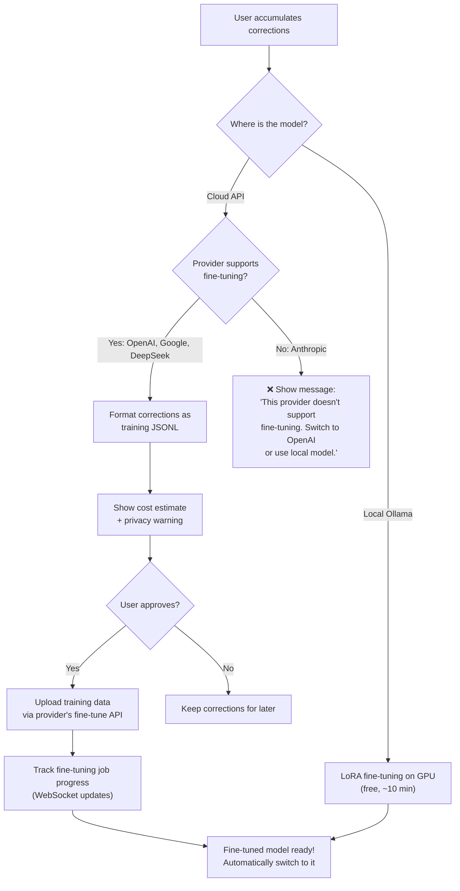
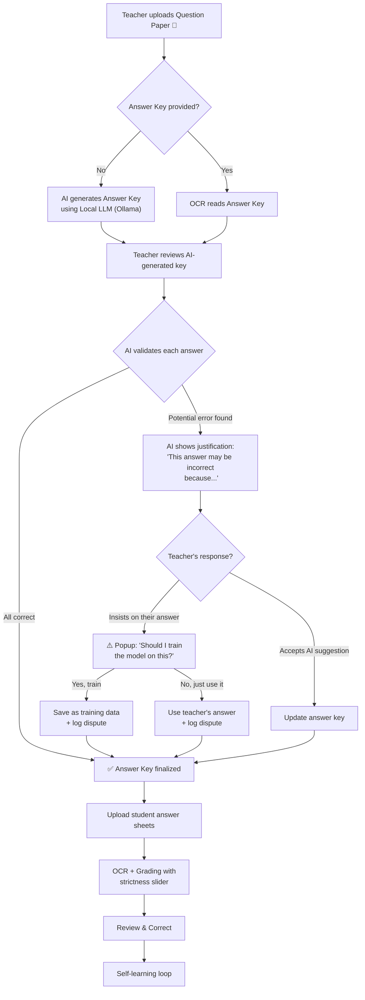
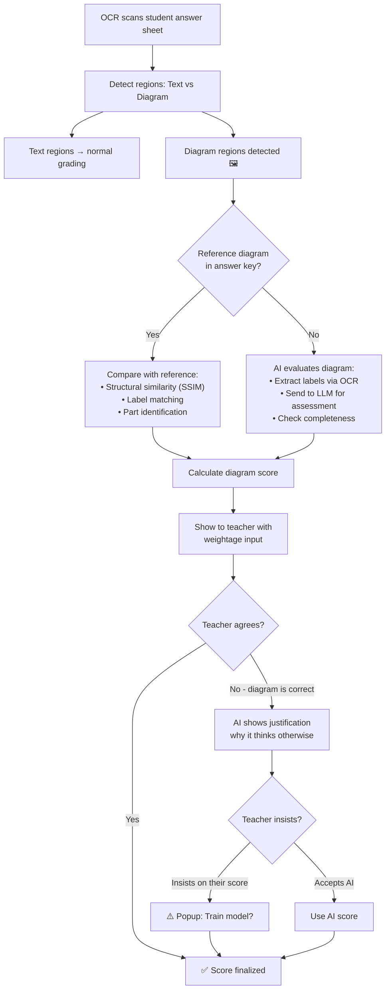
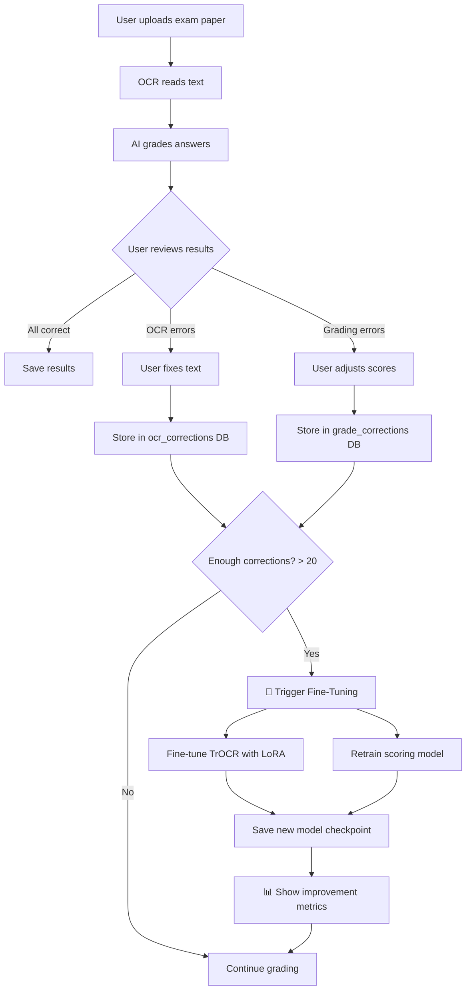

# 🎓 AI Exam Paper Evaluator — "PaperMind"

An AI-powered exam paper evaluation system that reads answer sheets, grades them, learns from user corrections, and gets smarter over time — all running **locally** on your machine.

## Project Summary

**What it does:**
1. Teacher uploads **question paper** (mandatory) and optionally an **answer key**
2. If no answer key → AI **generates one** using a local LLM for teacher review
3. Teacher reviews AI-generated key — AI **validates teacher's answers** and flags potential errors with justification
4. If teacher disagrees with AI → dispute is logged with teacher name, date/time, and full conversation
5. AI reads student answer sheets using fine-tunable OCR (TrOCR)
6. AI evaluates answers with configurable strictness (0–100 slider)
7. User reviews results and corrects any mistakes
8. System stores corrections and fine-tunes its models — **it learns and improves!**

**Why interviewers will love it:**
- Covers **Computer Vision, NLP, Transfer Learning, Active Learning, Local LLM, Full-Stack**
- **AI-Teacher collaboration** with dispute resolution and audit trails
- Runs entirely offline — no API keys, no cloud dependency
- Demonstrates understanding of **real ML pipelines**, not just API wrappers

---

## Hardware Compatibility

| Resource | Available | Required | Status |
|---|---|---|---|
| GPU | RTX 4060 8GB | 4GB+ VRAM | ✅ Excellent |
| RAM | 32GB | 16GB+ | ✅ More than enough |
| Disk | 252GB | ~10GB | ✅ Plenty |
| CUDA | Needs install | Required for GPU training | ⚠️ Will set up |

---

## Tech Stack

| Component | Technology | Why This Choice |
|---|---|---|
| **Backend** | Python 3.11 + FastAPI | Industry standard for ML, REST API serving |
| **Frontend** | React + Vite + Tailwind CSS | Modern, fast, impressive for interviews |
| **LLM Interface** | **LiteLLM** | 🔑 **One unified API** for ALL models — Ollama, OpenAI, Gemini, Claude, etc. |
| **Local Models** | Ollama + User's choice | Swappable models, runs offline on GPU |
| **Cloud Models** | OpenAI / Google Gemini / Anthropic / any API | User provides their own API key — **also supports cloud fine-tuning** |
| **OCR Model** | TrOCR / GOT-OCR2.0 / Multimodal LLM | **User-swappable** — multiple options |
| **Image Processing** | OpenCV + Pillow | Preprocessing scans for better OCR |
| **Answer Grading** | sentence-transformers | Semantic similarity, runs locally, ~100MB |
| **Keyword Check** | KeyBERT | Extract & match key concepts |
| **Database** | SQLite | Zero config, stores corrections + dispute logs |
| **ML Framework** | PyTorch + HuggingFace | Industry standard, great ecosystem |
| **Fine-tuning** | **Unsloth** + LoRA (local) / Colab/Kaggle (free cloud) / Provider API (paid cloud) | 2-5x faster, 60% less VRAM, all free options |

### Why LiteLLM and NOT LangChain?

> [!IMPORTANT]
> **We deliberately chose NOT to use LangChain/LangGraph.** Here's why:

| | ❌ LangChain | ✅ LiteLLM (Our Choice) |
|---|---|---|
| **Size** | 100+ sub-dependencies, heavy | Lightweight, single package |
| **Abstraction** | Hides how things work | You see & control everything |
| **Interview impression** | *"You just used a framework"* | *"I built the pipeline, LiteLLM just handles API calls"* |
| **What it does** | Chains, agents, memory, tools... | **ONE thing well**: unified API to call any LLM |
| **Learning curve** | High, constantly changing API | Minimal — 3 lines of code to call any model |

**LiteLLM in action — same code for LOCAL and CLOUD:**

```python
from litellm import completion

# Local model (Ollama) — no API key needed
response = completion(
    model="ollama/gemma3:12b",
    messages=[{"role": "user", "content": "Answer this question..."}]
)

# Cloud model (OpenAI) — user provides API key
response = completion(
    model="gpt-4o",
    api_key=user_api_key,
    messages=[{"role": "user", "content": "Answer this question..."}]
)

# Cloud model (Google Gemini)
response = completion(
    model="gemini/gemini-2.5-flash",
    api_key=user_api_key,
    messages=[{"role": "user", "content": "Answer this question..."}]
)

# SAME code. SAME interface. Just change the model name.
```

> [!TIP]
> In interviews, you can say: *"I evaluated LangChain but chose LiteLLM because I wanted to build the orchestration pipeline myself to deeply understand the architecture, while using LiteLLM only for the model interface layer. This kept dependencies minimal and let me support 100+ models with zero code changes."*
> 
> This shows **engineering judgment** — knowing when NOT to use a framework is as impressive as knowing when to use one.

### Compatible Models (examples — system auto-discovers the latest!)

The model settings page dynamically fetches the latest models from Ollama's library. Here are some **known-good models** that fit your hardware — but by your placement date, even newer ones will be available and auto-discovered:

#### 🧠 For Answer Generation / Validation / Dispute Justification (LLM)

| # | Model | Params | VRAM (Q4) | Why It's Great | Ollama Command |
|---|---|---|---|---|---|
| 🥇 | **Gemma 3 12B** | 12B | ~7 GB | **Multimodal!** Can see images — could do OCR + answer evaluation + diagram checking in ONE model | `ollama pull gemma3:12b` |
| 🥈 | **Qwen 3 8B** | 8B | ~5 GB | Excellent reasoning, multilingual, latest architecture (2025) | `ollama pull qwen3:8b` |
| 🥉 | **Phi-4 Mini** | 3.8B | ~2.5 GB | Surprisingly powerful reasoning for its tiny size, leaves VRAM for other models | `ollama pull phi4-mini` |
| 4 | **DeepSeek R1 Distill 8B** | 8B | ~5 GB | Top-tier reasoning, chain-of-thought built-in | `ollama pull deepseek-r1:8b` |
| 5 | **Llama 3.3 8B** | 8B | ~5 GB | Meta's latest, strong all-rounder | `ollama pull llama3.3:8b` |
| 6 | **Gemma 3 4B** | 4B | ~2.5 GB | Multimodal + lightweight — great if running multiple models | `ollama pull gemma3:4b` |

> [!TIP]
> **🏆 Top Pick: Gemma 3 12B** — It's **multimodal** (understands images!). This means it can:
> - Read handwriting directly from images (potential TrOCR replacement)
> - Evaluate diagrams by actually **seeing** them (not just reading labels)
> - Generate & validate answers with strong reasoning
> - All from ONE model, ~7GB VRAM
>
> **Runner-up: Qwen 3 8B** — If you want to run LLM + TrOCR + sentence-transformers simultaneously, Qwen 3 at ~5GB leaves breathing room.

#### 📸 For OCR (Reading Handwritten Text)

| # | Model | Type | VRAM | Best For |
|---|---|---|---|---|
| 🥇 | **Gemma 3 12B/4B** | Multimodal LLM | shared | Direct image → text (no preprocessing needed!) |
| 🥈 | **GOT-OCR2.0** | Dedicated OCR | ~2 GB | State-of-the-art OCR, handles complex layouts |
| 🥉 | **TrOCR** (`trocr-base-handwritten`) | Dedicated OCR | ~1.5 GB | Lightweight, fine-tunable with LoRA, proven |
| 4 | **Florence-2** | Multimodal | ~2 GB | Microsoft's newer model, good OCR + captioning |

#### 📊 For Sentence Similarity (Grading)

| # | Model | Size | Speed |
|---|---|---|---|
| 🥇 | **all-MiniLM-L6-v2** | 80 MB | Very fast |
| 🥈 | **all-mpnet-base-v2** | 420 MB | More accurate, slightly slower |
| 🥉 | **BGE-small-en-v1.5** | 130 MB | Good balance |

### ⭐ Model Selector / Switcher Feature

This is a **unique feature** that almost no college project has — users can **swap models from the UI**!

#### [NEW] `src/models/model_manager.py`

```python
class ModelManager:
    """
    Manages all AI models — users can switch models from the settings page.
    """
    
    def list_available_models(self) -> list[ModelInfo]:
        """Query Ollama API for installed models + show downloadable ones"""
        # Returns: name, size, VRAM needed, capabilities, is_installed
    
    def switch_llm(self, model_name: str) -> bool:
        """Switch the active LLM (e.g., from Qwen 3 to Gemma 3)"""
        # Checks VRAM availability before switching
        # Unloads current model, loads new one
    
    def switch_ocr(self, model_name: str) -> bool:
        """Switch OCR model (TrOCR vs GOT-OCR vs multimodal)"""
    
    def download_model(self, model_name: str, callback) -> None:
        """Download a new model via Ollama with progress callback"""
        # ollama.pull(model_name) with streaming progress
    
    def get_vram_usage(self) -> VRAMReport:
        """Show current GPU memory usage breakdown"""
        # Returns: { llm: 5.2GB, ocr: 1.5GB, embeddings: 0.3GB, free: 1.0GB }
    
    def recommend_models(self, gpu_vram: int) -> list[ModelConfig]:
        """Auto-recommend the best model combo for user's hardware"""
```

#### React Settings Page (in UI)

```
┌─────────────────────────────────────────────────────────────┐
│  ⚙️ Model Settings                                         │
│                                                             │
│  GPU: NVIDIA RTX 4060 — 8 GB VRAM                          │
│  ████████████████████░░░░  6.5 / 8.0 GB used               │
│                                                             │
│  ┌─────────────────────────────────────────────────────┐    │
│  │ 🧠 LLM Model (Answer Generation & Validation)      │    │
│  │                                                     │    │
│  │  ● Gemma 3 12B (Q4)     ~7.0 GB  ⭐ Recommended    │    │
│  │  ○ Qwen 3 8B (Q4)       ~5.0 GB  ✅ Installed      │    │
│  │  ○ Phi-4 Mini            ~2.5 GB  ✅ Installed      │    │
│  │  ○ DeepSeek R1 8B (Q4)  ~5.0 GB  📥 Download       │    │
│  │                                                     │    │
│  │  [ Apply ]                                          │    │
│  └─────────────────────────────────────────────────────┘    │
│                                                             │
│  ┌─────────────────────────────────────────────────────┐    │
│  │ 📸 OCR Model (Reading Handwritten Text)             │    │
│  │                                                     │    │
│  │  ● TrOCR Handwritten     ~1.5 GB  ✅ Installed      │    │
│  │  ○ GOT-OCR2.0            ~2.0 GB  📥 Download       │    │
│  │  ○ Use LLM (Gemma 3)     shared   🔗 Uses LLM      │    │
│  │                                                     │    │
│  │  [ Apply ]                                          │    │
│  └─────────────────────────────────────────────────────┘    │
│                                                             │
│  ┌─────────────────────────────────────────────────────┐    │
│  │ 📊 Embedding Model (Answer Similarity)              │    │
│  │                                                     │    │
│  │  ● all-MiniLM-L6-v2      ~80 MB   ✅ Fast           │    │
│  │  ○ all-mpnet-base-v2     ~420 MB  More accurate     │    │
│  │                                                     │    │
│  │  [ Apply ]                                          │    │
│  └─────────────────────────────────────────────────────┘    │
│                                                             │
│  [ 🔍 Auto-Detect Best Config ]   [ 📥 Download All ]      │
└─────────────────────────────────────────────────────────────┘
```

**Features:**
- **Auto-detect GPU** → recommend optimal model combination
- **VRAM calculator** → shows if a model will fit before loading
- **One-click download** via Ollama with progress bar
- **Hot-swap** — switch models without restarting the app
- **Benchmark mode** — compare two models on the same paper side-by-side
- **Training persistence** — fine-tuning is NEVER lost (see below)

### 🔄 Training Persistence — Solving the Model Switch Problem

> [!IMPORTANT]
> **Problem**: If you fine-tune TrOCR with 100 corrections and then switch to GOT-OCR2.0, is all that training lost?
> 
> **Answer: NO.** We solve this with a smart 3-layer architecture:

```
┌─────────────────────────────────────────────────────────┐
│  Layer 1: Corrections Database (PERMANENT, model-free)  │
│                                                         │
│  All corrections are stored INDEPENDENTLY of any model  │
│  ┌─────────────────────────────────────────────────┐    │
│  │ ocr_corrections: image_region → correct_text    │    │
│  │ grade_corrections: answer → correct_score       │    │
│  │ diagram_corrections: diagram → correct_eval     │    │
│  │ dispute_history: all teacher disputes            │    │
│  └─────────────────────────────────────────────────┘    │
│  These NEVER get deleted. They are your training gold.  │
└─────────────────────────────────────────────────────────┘
                          │
                          ▼
┌─────────────────────────────────────────────────────────┐
│  Layer 2: Per-Model Checkpoints (one per model)         │
│                                                         │
│  models/                                                │
│  ├── trocr_base/              (original download)       │
│  ├── trocr_finetuned_v3/      (your 3rd fine-tune)      │
│  ├── got-ocr_base/            (original download)       │
│  ├── got-ocr_finetuned_v1/    (fine-tuned once)         │
│  └── gemma3_lora_adapter/     (LoRA weights only)       │
│                                                         │
│  Switch back to TrOCR? → loads trocr_finetuned_v3       │
│  Switch to GOT-OCR? → loads got-ocr_finetuned_v1        │
│  Each model keeps its OWN trained version!               │
└─────────────────────────────────────────────────────────┘
                          │
                          ▼
┌─────────────────────────────────────────────────────────┐
│  Layer 3: Retrain on Switch (migration assistant)       │
│                                                         │
│  When switching to a NEW model for the first time:      │
│                                                         │
│  "You have 147 stored corrections.                      │
│   This model hasn't been trained on them yet.           │
│                                                         │
│   [ 🔄 Train new model on all corrections ]             │
│   [ ⏭️ Use base model for now, train later ]"           │
│                                                         │
│  One click → applies ALL past corrections to new model  │
└─────────────────────────────────────────────────────────┘
```

#### [NEW] `src/models/checkpoint_manager.py`

```python
class CheckpointManager:
    """Manages per-model fine-tuned checkpoints"""
    
    def save_checkpoint(self, model_name: str, version: int, weights_path: str):
        """Save fine-tuned checkpoint for a specific model"""
    
    def load_checkpoint(self, model_name: str) -> str | None:
        """Load the latest fine-tuned checkpoint for a model (if exists)"""
    
    def get_training_status(self, model_name: str) -> TrainingStatus:
        """Returns: { 
            has_checkpoint: True, 
            version: 3, 
            corrections_used: 87, 
            pending_corrections: 60,  # new corrections since last train
            accuracy_improvement: "+12.3%"
        }"""
    
    def migrate_corrections(self, target_model: str, corrections: list):
        """Apply stored corrections to a new model via fine-tuning"""
```

**Why this is interview gold:**
> *"When a user switches models, fine-tuning isn't lost. Corrections are stored model-independently in SQLite. Each model has its own checkpoint directory with versioned fine-tuned weights. When switching to a model for the first time, the system offers to apply all accumulated corrections via one-click retraining. When switching back, it loads the previously fine-tuned version."*

This demonstrates understanding of: **model versioning, training data management, checkpoint systems, and production ML infrastructure**.

### 🌐 Dynamic Model Discovery — Always Use the Latest

> [!IMPORTANT]
> We do NOT hardcode model names. The system dynamically discovers available models from Ollama's library so it **always works with the newest models** — even ones released after we build this.

#### [NEW] `src/models/registry.py`

```python
class ModelRegistry:
    """
    Dynamically discovers models — no hardcoded model list!
    Works with Gemma 4, Llama 5, Qwen 4, or whatever comes next.
    """
    
    def get_installed_models(self) -> list[ModelInfo]:
        """Query Ollama: 'ollama list' → returns all installed models"""
    
    def get_available_models(self) -> list[ModelInfo]:
        """Query Ollama library API → returns all downloadable models"""
        # Fetches from: https://ollama.com/library
        # Filters by: fits in user's VRAM
    
    def get_model_capabilities(self, model_name: str) -> ModelCapabilities:
        """Auto-detect if a model supports: text, vision, code, etc."""
        # Returns: { supports_vision: True, supports_text: True, ... }
        # If vision=True → can be used for OCR AND diagram evaluation
    
    def recommend_best(self, gpu_vram_gb: float) -> list[ModelRecommendation]:
        """
        Scans all available models, filters by VRAM,
        ranks by benchmark scores, returns top recommendations.
        
        Works with ANY future model — Gemma 4, Llama 5, whatever!
        """
```

**How it works in the UI:**
- Settings page shows a **live list** from Ollama's library
- Models are auto-tagged: `🖼️ Vision` `💬 Text` `🧠 Reasoning`
- VRAM filter: only shows models that fit your GPU
- Sorted by: most recent → best performance → smallest size
- User just picks one — system handles the rest

> [!TIP]
> By the time you demo this in placements, even newer models will exist. Your system will automatically discover and support them — you won't need to update any code!

### ☁️ Cloud API Support — Use Any Provider with Your API Key

Not everyone has a GPU. And some users want the accuracy of larger cloud models. PaperMind supports **both local AND cloud** seamlessly via LiteLLM.

#### [NEW] `src/models/cloud_provider.py`

```python
class CloudProvider:
    """
    Manages cloud API connections.
    User provides their own API key — we never store/share it.
    """
    
    SUPPORTED_PROVIDERS = {
        "openai":    {"models": ["gpt-4o", "gpt-4o-mini", "o3-mini"],
                      "fine_tunable": True,  "vision": True},
        "google":    {"models": ["gemini-2.5-pro", "gemini-2.5-flash"],
                      "fine_tunable": True,  "vision": True},
        "anthropic": {"models": ["claude-sonnet-4", "claude-haiku"],
                      "fine_tunable": False, "vision": True},
        "deepseek":  {"models": ["deepseek-chat", "deepseek-reasoner"],
                      "fine_tunable": True,  "vision": False},
        # ... more providers auto-discovered via LiteLLM
    }
    
    def validate_api_key(self, provider: str, api_key: str) -> bool:
        """Test if the API key is valid with a simple ping"""
    
    def estimate_cost(self, model: str, task: str, num_papers: int) -> CostEstimate:
        """
        Estimate cost BEFORE running:
        'Grading 30 papers with gpt-4o will cost approximately $0.45'
        """
    
    def get_fine_tune_cost(self, model: str, num_corrections: int) -> CostEstimate:
        """Estimate fine-tuning cost: 'Fine-tuning gpt-4o-mini with 200 
        corrections will cost approximately $2.50'"""
```

#### Cloud Fine-Tuning Flow



**How cloud fine-tuning works per provider:**

| Provider | Fine-tune API | Cost (approx. 200 corrections) | Time |
|---|---|---|---|
| **OpenAI** | `client.fine_tuning.jobs.create()` | ~$2-5 | 30-60 min |
| **Google Gemini** | Vertex AI Tuning API | ~$3-8 | 1-2 hours |
| **DeepSeek** | DeepSeek Fine-tune API | ~$1-3 | 30-60 min |
| **Local (Ollama)** | LoRA on your GPU | **Free** | 5-15 min |

#### React API Key Settings UI

```
┌─────────────────────────────────────────────────────────────┐
│  ☁️ Cloud API Settings                                      │
│                                                             │
│  ┌─── Provider ──────────────────────────────────────┐      │
│  │  ○ 🏠 Local (Ollama) — Free, private, no internet │      │
│  │  ● ☁️ Cloud API — Faster, more accurate            │      │
│  └────────────────────────────────────────────────────┘      │
│                                                             │
│  Provider:  [ OpenAI      ▼ ]                               │
│  API Key:   [ sk-●●●●●●●●●●●●●●●●aBcD ]  [👁️] [Test ✅]    │
│  Model:     [ gpt-4o      ▼ ]                               │
│                                                             │
│  ┌─── Privacy & Cost ────────────────────────────────┐      │
│  │  ⚠️ Cloud mode sends exam data to the provider.   │      │
│  │  Estimated cost for 30 papers: ~$0.45              │      │
│  │                                                    │      │
│  │  [✓] I understand data leaves my machine           │      │
│  └────────────────────────────────────────────────────┘      │
│                                                             │
│  Fine-tuning:                                               │
│  You have 147 corrections. Fine-tune cloud model?           │
│  Estimated cost: ~$3.20                                     │
│  [ 🔄 Fine-Tune on Cloud ]  [ 💾 Keep Local Only ]          │
│                                                             │
│  [ Save Settings ]                                          │
└─────────────────────────────────────────────────────────────┘
```

**Key features:**
- 🔐 **API keys stored locally** (encrypted in SQLite) — never sent anywhere except the provider
- 💰 **Cost estimation** before every action — no surprise bills
- ⚠️ **Privacy toggle** — explicit consent before sending exam data to cloud
- 🔄 **Seamless switching** — go from local → cloud → back to local anytime
- 📊 **Usage tracking** — shows how much you've spent this session/month

### 🆓 Free Fine-Tuning Options — You Don't Need to Pay!

> [!TIP]
> **You probably don't need paid cloud fine-tuning at all.** Between Unsloth (making local training super efficient) and free cloud GPUs (Colab/Kaggle), everything can be done for **$0**.

#### ⚡ Unsloth — The Game Changer (LOCAL, FREE)

[Unsloth](https://github.com/unslothai/unsloth) makes LoRA fine-tuning dramatically faster and lighter:

| | Without Unsloth | **With Unsloth** |
|---|---|---|
| **Speed** | 1x (baseline) | **2-5x faster** |
| **VRAM** | ~6-8 GB for 8B model | **~3-4 GB** (60% less!) |
| **What this means** | RTX 4060 can barely train 8B | RTX 4060 can comfortably train **12B+** |
| **Cost** | Free | **Free** |
| **Models supported** | — | Llama, Gemma, Qwen, Phi, Mistral, and more |

```python
# Unsloth fine-tuning — just 4 lines different from normal HuggingFace!
from unsloth import FastLanguageModel

model, tokenizer = FastLanguageModel.from_pretrained(
    model_name="unsloth/gemma-3-12b-bnb-4bit",  # Any model
    max_seq_length=2048,
    load_in_4bit=True,  # Fits in 8GB VRAM!
)

model = FastLanguageModel.get_peft_model(model, r=16, lora_alpha=16)
# ... train as normal with HuggingFace Trainer
# 2-5x faster than without Unsloth!
```

**Why this is huge for your project:**
- Fine-tune a 12B parameter model on your RTX 4060 that would normally need 24GB VRAM
- Training 200 corrections takes ~5 minutes instead of ~20
- In interviews: *"I used Unsloth for parameter-efficient fine-tuning, which reduced VRAM usage by 60% and training time by 3x, allowing me to fine-tune a 12B model on a consumer GPU"*

#### ☁️ Free Cloud GPUs — For When Local Isn't Enough

| Platform | GPU | VRAM | Free Limit | Best For |
|---|---|---|---|---|
| **Google Colab** | T4 | **15 GB** | ~12hr sessions | Models too big for local (e.g., 14B+) |
| **Kaggle** | T4 x2 | **30 GB** | 30 hrs/week | Heavy training, large datasets |
| **Lightning.ai** | Various | Varies | Free credits | Quick experiments |
| **HuggingFace Spaces** | T4 | 15 GB | Free tier | AutoTrain (one-click) |

#### [NEW] `src/models/training_router.py`

The system **automatically picks the best training environment:**

```python
class TrainingRouter:
    """Decides WHERE to fine-tune based on model size and available resources"""
    
    def get_training_plan(self, model_name: str, num_corrections: int) -> TrainingPlan:
        """
        Returns the optimal training strategy:
        
        Model fits locally (with Unsloth)?
          → Train on RTX 4060 (free, fast, private)
        
        Model too big for local GPU?
          → Option 1: Export notebook → open in Google Colab (free)
          → Option 2: Export notebook → open in Kaggle (free)
          → Option 3: Use cloud fine-tune API (paid, with cost estimate)
        """
    
    def export_colab_notebook(self, model: str, corrections: list) -> str:
        """Generate a ready-to-run Colab notebook with:
        - Unsloth setup
        - Training data pre-loaded
        - Model download
        - One-click train button
        - Auto-download fine-tuned weights back to local
        Returns: .ipynb file path
        """
    
    def export_kaggle_notebook(self, model: str, corrections: list) -> str:
        """Same as Colab but optimized for Kaggle's dual-T4 setup"""
```

**User flow in the UI:**

```
┌─────────────────────────────────────────────────────────────┐
│  🔄 Fine-Tune Model — 147 corrections available            │
│                                                             │
│  Current model: Gemma 3 12B (Q4)                            │
│                                                             │
│  Training Options:                                          │
│                                                             │
│  ● 🏠 Local (Unsloth + RTX 4060)    ⭐ Recommended          │
│    └ ~5 min • Free • Private • VRAM: 3.8/8.0 GB ✅          │
│                                                             │
│  ○ 📓 Google Colab (Free T4 GPU)                            │
│    └ ~8 min • Free • Requires Google login                  │
│    └ [ Export Notebook 📥 ] → opens in Colab                │
│                                                             │
│  ○ 📓 Kaggle (Free T4 x2 GPU)                              │
│    └ ~6 min • Free • 30 hrs/week limit                      │
│    └ [ Export Notebook 📥 ] → opens in Kaggle               │
│                                                             │
│  ○ ☁️ Cloud API (OpenAI/Google Fine-tune)                   │
│    └ ~45 min • ~$3.20 • Data leaves machine                 │
│                                                             │
│  [ 🚀 Start Training ]                                      │
└─────────────────────────────────────────────────────────────┘
```

> [!NOTE]
> **Interview talking point:** *"I built a training router that automatically selects the optimal fine-tuning environment. Locally, Unsloth reduces VRAM by 60%, so a 12B model trains on an 8GB GPU. For larger models, the system exports a pre-configured Jupyter notebook to Google Colab or Kaggle — completely free. Paid cloud fine-tuning via OpenAI/Gemini APIs is also supported for users who prefer it, with cost estimation upfront."*

---

## Architecture

```
┌──────────────────────────────────────────────────────────────────────┐
│                          STREAMLIT UI                                │
│  ┌───────────┐ ┌──────────────┐ ┌─────────────┐ ┌──────────────┐   │
│  │  Upload    │ │ Answer Key   │ │  Grade &    │ │  Analytics   │   │
│  │  Q.Paper   │ │ Review &     │ │  Review     │ │  & Dispute   │   │
│  │  + Key     │ │ Dispute      │ │  + Correct  │ │  Logs        │   │
│  └─────┬──── ┘ └──────┬───────┘ └──────┬──────┘ └──────────────┘   │
│  🎚️ Strictness Slider (0-100)          │                            │
└────────┼───────────────┼────────────────┼───────────────────────────┘
         │               │                │
         ▼               ▼                ▼
┌──────────────┐  ┌─────────────────┐  ┌─────────────────┐
│  OCR Pipeline │  │  Knowledge      │  │ Correction Store │
│              │  │  Engine         │  │   (SQLite DB)    │
│ OpenCV       │  │                 │  │                  │
│   ↓          │  │ Ollama LLM      │  │ OCR corrections  │
│ TrOCR Model  │  │ (User's choice) │  │ Grade corrections│
│   ↓          │  │   ↓             │  │ Dispute logs     │
│ Text Output  │  │ Generate Keys   │  │ Teacher profiles │
└──────┬───────┘  │ Validate Ans    │  └────────┬────────┘
       │          │ Justify Errors  │           │
       ▼          └────────┬────────┘           ▼
┌──────────────┐           │           ┌─────────────────┐
│   Grading    │◄──────────┘           │  Fine-Tuning    │
│   Engine     │                       │  Pipeline       │
│              │                       │                 │
│ Strictness   │                       │ Retrain TrOCR   │
│ Curve        │                       │ Retrain Scorer  │
│   +          │                       │ Dispute-aware   │
│ Sentence     │                       │ Training        │
│ Similarity   │                       └─────────────────┘
│   +          │
│ Keyword      │
│ Matching     │
│   ↓          │
│ Score + Why  │
└──────────────┘
```

### Core Flow



---

## Proposed Changes — Phase-by-Phase Build

We'll build this in **8 phases**, each adding a working feature. You'll have a demo-able project after Phase 5 itself.

---

### Phase 1: Project Setup & Environment (~30 mins)

#### [NEW] `requirements.txt`
All Python dependencies pinned to compatible versions.

#### [NEW] `setup_env.py`  
A helper script that verifies CUDA, installs PyTorch with GPU support, and downloads required models.

#### [NEW] `README.md`
Project documentation with setup instructions, architecture diagram, and demo screenshots.

**What you'll learn**: Python virtual environments, dependency management, CUDA setup.

---

### Phase 2: Image Processing & OCR Pipeline (~2-3 hours)

#### [NEW] `src/ocr/preprocessing.py`
Image preprocessing pipeline using OpenCV:
- Convert to grayscale
- Noise removal (Gaussian blur, morphological operations)
- Binarization (adaptive thresholding)  
- Deskewing (straighten tilted scans)
- Line/question segmentation (split paper into individual answers)

#### [NEW] `src/ocr/text_extractor.py`
TrOCR-based text extraction:
- Load pre-trained `microsoft/trocr-base-handwritten` model
- Process each segmented answer region
- Return extracted text with confidence scores
- GPU-accelerated inference

#### [NEW] `src/ocr/pipeline.py`
End-to-end OCR pipeline that chains preprocessing → segmentation → extraction.

**What you'll learn**: OpenCV basics, HuggingFace model loading, GPU inference, image segmentation.

---

### Phase 3: Answer Evaluation & Grading Engine (~3-4 hours)

#### [NEW] `src/grading/answer_key.py`
Answer key management:
- Load answer keys from JSON/YAML files
- Support for MCQ answers, short answers, and descriptive answers
- Per-question marks allocation

#### [NEW] `src/grading/mcq_grader.py`
MCQ grading logic:
- Direct string matching after normalization
- Handle common OCR mistakes (O vs 0, l vs 1)
- Return correct/incorrect with marks

#### [NEW] `src/grading/strictness_curve.py` ⭐ NEW FEATURE
**Strictness Slider** — a scoring curve that controls how leniently or strictly answers are graded.

**UI**: A slider from **0 (very lenient)** to **100 (very strict)** in the Streamlit sidebar.

**How it works mathematically:**

The raw similarity score (0.0–1.0) from sentence-transformers is passed through a **power curve** controlled by the strictness value:

```python
def apply_strictness(similarity: float, strictness: int) -> float:
    """
    Maps raw similarity score to final marks percentage
    using a power curve controlled by strictness.
    
    strictness: 0 (lenient) to 100 (strict)
    """
    # Map strictness 0-100 → exponent 0.3 to 2.5
    # Using exponential interpolation for smooth curve
    exponent = 0.3 * (8.33 ** (strictness / 100.0))
    
    # Apply power curve
    marks_ratio = similarity ** exponent
    
    return marks_ratio
```

**Example: Student answer has 70% semantic similarity**

| Strictness | Label | Exponent | Marks Awarded |
|---|---|---|---|
| **0** | Very Lenient | 0.30 | **~89%** ✅ |
| **25** | Lenient | 0.51 | **~82%** |
| **50** | Medium | 0.87 | **~73%** |
| **75** | Strict | 1.47 | **~58%** |
| **100** | Very Strict | 2.50 | **~42%** |

The curve is smooth and continuous — no hard boundaries between easy/medium/hard. Users can fine-tune to any level they want.

**Visual in UI**: The scoring curve will be plotted live as the user moves the slider, so they can see exactly how it affects grading.

```
Marks %
100│ ╲  ← Lenient (strictness=0)
   │  ╲╲
 75│   ╲ ╲  ← Medium (strictness=50)
   │    ╲  ╲
 50│     ╲   ╲  ← Strict (strictness=100)
   │      ╲    ╲
 25│       ╲     ╲
   │        ╲      ╲
  0└──────────────────
   0    25   50   75  100
          Similarity %
```

#### [NEW] `src/grading/subjective_grader.py`
Subjective answer grading using sentence-transformers + strictness curve:
- Load `all-MiniLM-L6-v2` model (~80MB, runs fast on GPU)
- Compute cosine similarity between student answer & model answer
- Keyword presence checking using KeyBERT
- Combined raw score: 60% semantic similarity + 40% keyword coverage
- **Apply strictness curve** to transform raw score → final marks
- Return score + explanation of why (including strictness level used)

#### [NEW] `src/grading/grading_engine.py`
Orchestrator that routes each question to the right grader (MCQ vs subjective).
- Accepts global strictness setting from UI
- MCQ grading is **not affected** by strictness (answer is either right or wrong)
- Subjective grading uses the strictness curve
- Returns per-question breakdown showing: raw similarity, strictness applied, final marks

**What you'll learn**: Sentence embeddings, cosine similarity, NLP pipelines, scoring algorithms, mathematical curve design, parameterized scoring.

---

### Phase 4: Diagram Detection & Evaluation ⭐ (~3-4 hours)

Students often draw **diagrams** in answers (biology diagrams, circuit diagrams, flowcharts, maps, etc.). PaperMind should handle these too!

#### How It Works



#### [NEW] `src/diagram/__init__.py`

#### [NEW] `src/diagram/detector.py`
Detect and separate diagram regions from text in answer sheets:
- Use **OpenCV contour detection** to find non-text regions
- Classify regions as: text, diagram, table, or mixed
- Techniques:
  - Adaptive thresholding + morphological operations
  - Connected component analysis
  - Area & aspect ratio filtering (diagrams are usually larger, squarish regions)
- Return list of cropped diagram images with bounding box coordinates

```python
def detect_diagrams(answer_image: np.ndarray) -> list[DiagramRegion]:
    """
    Returns: [
        DiagramRegion(
            image=cropped_image,       # The diagram image
            bbox=(x, y, w, h),         # Location on answer sheet
            confidence=0.87,           # How sure we are this is a diagram
            has_labels=True,           # Whether text labels are detected inside
            question_number=3          # Which question this belongs to
        )
    ]
    """
```

#### [NEW] `src/diagram/label_extractor.py`
Extract text labels from within diagrams:
- Use TrOCR/Tesseract specifically on diagram regions
- Identify label text (usually shorter, positioned near arrows/lines)
- Map labels to their positions in the diagram
- Return structured label data

```python
def extract_labels(diagram_image: np.ndarray) -> list[DiagramLabel]:
    """
    Returns: [
        DiagramLabel(text="Mitochondria", position=(120, 45), confidence=0.91),
        DiagramLabel(text="Cell Wall", position=(200, 80), confidence=0.85),
        DiagramLabel(text="Nucleus", position=(150, 130), confidence=0.93),
    ]
    """
```

#### [NEW] `src/diagram/evaluator.py`
Evaluate student diagrams — **two modes**:

**Mode 1: With Reference Diagram (answer key has a diagram)**
- **Structural Similarity (SSIM)**: Compare overall structure of student vs reference diagram
- **Label Matching**: Check if student's labels match reference labels (fuzzy string matching)
- **Part Completeness**: Count how many required parts/labels are present
- Combined score: 40% structure + 35% label accuracy + 25% completeness

**Mode 2: Without Reference (AI evaluates independently)**
- Extract labels from student diagram
- Send to local LLM with context:
  ```
  "The question asks to draw a diagram of [topic].
   The student drew a diagram with these labels: [label1, label2, label3].
   Expected labels for this topic typically include: [AI-generated list].
   Evaluate completeness and correctness."
  ```
- LLM returns evaluation with reasoning

```python
def evaluate_diagram(
    student_diagram: np.ndarray,
    student_labels: list[DiagramLabel],
    question_text: str,
    reference_diagram: np.ndarray | None = None,
    reference_labels: list[DiagramLabel] | None = None,
    subject: str = "Science"
) -> DiagramScore:
    """
    Returns: DiagramScore(
        score=7.5,                    # Out of max marks
        max_marks=10,
        structure_score=0.72,         # How well structure matches
        label_accuracy=0.85,          # Label correctness
        completeness=0.80,            # Parts present / parts expected
        missing_labels=["Golgi Body"],
        incorrect_labels=["Mitocondria → Mitochondria"],
        feedback="Good diagram. Missing Golgi Body label. 
                  'Mitocondria' is misspelled.",
        confidence=0.78
    )
    """
```

#### [NEW] `src/diagram/weightage.py`
Teacher-configurable diagram weightage system:

```python
class DiagramWeightage:
    """Teacher sets how much marks a diagram is worth"""
    diagram_marks: float         # e.g., 3 out of 10 total question marks
    label_weight: float          # % of diagram marks for correct labels (default 40%)
    structure_weight: float      # % for overall structure (default 35%)
    completeness_weight: float   # % for having all parts (default 25%)
    
    # Teacher can also specify:
    required_labels: list[str]   # Must-have labels (lose marks if missing)
    optional_labels: list[str]   # Nice-to-have labels (bonus marks)
```

**UI for teacher**: A simple form per question:
```
┌─────────────────────────────────────────────────┐
│  📊 Diagram Weightage — Question 5              │
│                                                  │
│  Does this question have a diagram?  [✅ Yes]    │
│                                                  │
│  Diagram marks: [3] out of [10] total marks     │
│                                                  │
│  Label weight:      [40%] ████████░░             │
│  Structure weight:  [35%] ███████░░░             │
│  Completeness:      [25%] █████░░░░░             │
│                                                  │
│  Required labels (comma separated):              │
│  [Nucleus, Cell Wall, Mitochondria, ...]        │
│                                                  │
│  Reference diagram: [📎 Upload] (optional)       │
└─────────────────────────────────────────────────┘
```

#### Diagram Dispute Resolution
Same flow as text answers — if AI and teacher disagree on a diagram evaluation:

1. **AI says diagram is wrong, teacher says it's correct:**
   - AI shows justification: *"The diagram is missing labels for: Golgi Body, Endoplasmic Reticulum. Structure similarity with reference is only 52%."*
   - Teacher can insist → **popup**: *"Should I train the model to accept this diagram style?"*

2. **AI says diagram is correct, teacher says it's wrong:**
   - Teacher explains why → AI acknowledges and asks: *"Should I train with your evaluation?"*

3. **All disputes logged** with:
   - Both diagram images (student + reference)
   - Both sets of labels
   - Teacher's reasoning
   - Date, time, teacher name

**What you'll learn**: Image segmentation, contour detection, structural similarity (SSIM), label extraction, multimodal AI evaluation, configurable scoring systems.

---

### Phase 5: Knowledge Engine — Answer Key Generation, Validation & Dispute Resolution ⭐ (~3-4 hours)

This is the **teacher collaboration system** — one of the most impressive parts of your project.

#### [NEW] `src/knowledge/__init__.py`

#### [NEW] `src/knowledge/llm_client.py`
Interface to Ollama local LLM:
- Connect to Ollama running locally (supports any installed model — Gemma 3, Qwen 3, Phi-4, etc.)
- **Model-agnostic**: works with any Ollama model, user selects via Model Settings page
- Send question → get model-generated answer
- Configurable prompts for different question types (MCQ, short answer, descriptive)
- Fallback handling if Ollama is not running

```python
# How it works internally
def generate_answer(question: str, subject: str, question_type: str) -> dict:
    """
    Ask local LLM to answer a question.
    Returns: {
        "answer": "The answer text",
        "confidence": 0.85,
        "reasoning": "Step-by-step explanation",
        "key_concepts": ["concept1", "concept2"]
    }
    """
```

#### [NEW] `src/knowledge/answer_generator.py`
Generate complete answer keys from question papers:
- Takes OCR-extracted questions from the question paper
- Sends each question to local LLM with subject context
- Generates structured answer key with:
  - Answer text
  - Key concepts/keywords expected
  - Suggested marks allocation
  - Confidence level per answer
- Returns answer key in review-ready format for teacher

#### [NEW] `src/knowledge/answer_validator.py`
Validates teacher-provided answers against AI knowledge:
- For each answer in the teacher's key, AI cross-checks using the LLM
- If AI agrees → ✅ mark as validated
- If AI disagrees → ⚠️ generate a **justification** explaining why:

```python
def validate_answer(question: str, teacher_answer: str, subject: str) -> dict:
    """
    Returns: {
        "is_valid": False,
        "ai_answer": "The correct answer according to AI",
        "justification": "The teacher's answer states X, but according to 
                          [reasoning], the correct answer should be Y 
                          because [explanation]...",
        "confidence": 0.92,
        "sources": ["textbook concept", "standard definition"]
    }
    """
```

**The Dispute Flow:**
1. AI shows: *"⚠️ Q3: Your answer may be incorrect. [Justification with reasoning]"*
2. Teacher can:
   - **Accept AI suggestion** → answer key updated
   - **Modify their answer** → re-validated
   - **Insist on their answer** → triggers dispute popup

#### [NEW] `src/knowledge/dispute_manager.py`
Handles teacher-AI disagreements:

**The Popup Message:**
```
┌─────────────────────────────────────────────────┐
│  ⚠️ Answer Dispute — Question 3                │
│                                                 │
│  Your answer differs from the AI's assessment.  │
│                                                 │
│  Your answer: "Photosynthesis occurs in..."     │
│  AI's answer: "Photosynthesis primarily..."     │
│  AI's reasoning: "The teacher's answer..."      │
│                                                 │
│  Would you like to:                             │
│                                                 │
│  ☐ Train the model with my answer              │
│    (AI will learn your answer for future use)   │
│                                                 │
│  ☐ Use my answer WITHOUT training              │
│    (AI keeps its own knowledge unchanged)       │
│                                                 │
│  Teacher Name: [_______________]                │
│                                                 │
│  [ Cancel ]              [ Confirm & Log ]      │
└─────────────────────────────────────────────────┘
```

**What gets logged:**
- Teacher name
- Date & time (auto-captured)
- Question text
- Teacher's answer
- AI's answer + justification
- Teacher's decision (train / don't train)
- Full conversation thread

#### [NEW] `src/knowledge/dispute_logger.py`
SQLite-backed audit trail for all disputes:

```python
# Database schema
class DisputeLog:
    id: int                    # Auto-increment
    teacher_name: str          # Who disagreed
    timestamp: datetime        # When it happened
    question_text: str         # The question
    teacher_answer: str        # What teacher said
    ai_answer: str             # What AI said
    ai_justification: str      # Why AI thinks teacher is wrong
    teacher_decision: str      # "train" | "use_without_training"
    conversation_history: str  # Full back-and-forth (JSON)
    exam_name: str             # Which exam this was for
    subject: str               # Subject area
    resolved: bool             # Was it eventually resolved?
```

**Features:**
- Full conversation history stored as JSON (every back-and-forth)
- Searchable by teacher name, date range, subject
- Export dispute logs to CSV/PDF for review
- Dashboard view: disputes over time, most disputed topics, resolution rates

**What you'll learn**: Local LLM deployment (Ollama), prompt engineering, conflict resolution in AI systems, audit logging, database design.

---

### Phase 6: Full-Stack UI — React Frontend + FastAPI Backend (~5-7 hours)

This is a **full-stack web app** — much more impressive than Streamlit for interviews!

#### [NEW] `server/main.py` — FastAPI Backend
REST API serving all ML functionality:

```python
# Key API endpoints:
POST /api/upload/question-paper     # Upload & OCR question paper
POST /api/upload/answer-key         # Upload teacher's answer key (optional)
POST /api/upload/student-paper      # Upload student answer sheet

POST /api/answer-key/generate       # AI generates answer key from questions
POST /api/answer-key/validate       # Validate teacher answers against AI
POST /api/answer-key/finalize       # Lock in the final answer key

POST /api/grade                     # Grade a student paper
PUT  /api/grade/{id}/correct        # Submit corrections (OCR/score)
POST /api/grade/what-if             # Re-grade at different strictness

GET  /api/disputes                  # List all disputes
POST /api/disputes                  # Log a new dispute
GET  /api/disputes/{id}             # Get dispute details + conversation

POST /api/train/ocr                 # Trigger OCR fine-tuning
POST /api/train/grading             # Trigger grading model retraining
GET  /api/train/status              # Training progress

GET  /api/analytics/overview        # Dashboard data
GET  /api/analytics/accuracy        # Accuracy over time
GET  /api/analytics/disputes        # Dispute statistics

GET  /api/config/strictness         # Current strictness setting
PUT  /api/config/strictness         # Update strictness (0-100)
```

- CORS enabled for React dev server
- File upload with multipart/form-data
- WebSocket endpoint for real-time training progress
- Proper error handling & validation with Pydantic models

#### [NEW] `frontend/` — React + Vite + Tailwind CSS

```
frontend/
├── package.json
├── vite.config.js
├── tailwind.config.js
├── index.html
├── src/
│   ├── App.jsx                    # Router & layout
│   ├── main.jsx                   # Entry point
│   ├── api/                       # API client (axios)
│   │   └── client.js
│   ├── components/                # Reusable components
│   │   ├── Sidebar.jsx            # Strictness slider, teacher name
│   │   ├── FileUpload.jsx         # Drag & drop file upload
│   │   ├── StrictnessSlider.jsx   # 0-100 slider with live curve
│   │   ├── ScoreCurveChart.jsx    # Live strictness curve visualization
│   │   ├── DiagramViewer.jsx      # Display detected diagrams
│   │   ├── DisputePopup.jsx       # Modal for dispute resolution
│   │   ├── ConfidenceBadge.jsx    # 🟢🟡🔴 confidence indicators
│   │   └── WeightageForm.jsx      # Diagram weightage config
│   ├── pages/
│   │   ├── UploadPage.jsx         # Page 1: Upload Q.Paper + Key
│   │   ├── AnswerKeyReview.jsx    # Page 2: Review & validate key
│   │   ├── GradingPage.jsx        # Page 3: Upload student papers & grade
│   │   ├── ReviewCorrect.jsx      # Page 4: Review OCR & correct
│   │   ├── DiagramReview.jsx      # Page 5: Review diagram evaluations ⭐
│   │   ├── AnalyticsPage.jsx      # Page 6: Dashboard & charts
│   │   └── DisputeLogsPage.jsx    # Page 7: Audit trail & logs
│   └── hooks/                     # Custom React hooks
│       ├── useStrictness.js       # Strictness state management
│       └── useWebSocket.js        # Real-time training updates
```

**Page 5 — Diagram Review** ⭐ NEW
- Shows detected diagrams from student answers
- Side-by-side: student diagram ↔ reference diagram (if available)
- Detected labels highlighted with bounding boxes
- Weightage form: teacher sets marks for diagram
- Score breakdown: structure / labels / completeness
- Same dispute flow for diagram evaluations

**Responsive Design**: Works on desktop and tablet (teachers may use tablets)

**Charts**: Using **Recharts** library for analytics visualizations

**What you'll learn**: React components, state management, REST API design, Tailwind CSS, responsive design, WebSockets, full-stack architecture.

---

### Phase 7: Self-Learning Pipeline — THE STAR FEATURE ⭐ (~3-4 hours)

This is what makes your project **stand out from 99% of college projects**.

#### [NEW] `src/learning/correction_store.py`
SQLite database to store all user corrections:
- Table: `ocr_corrections` — (image_region, wrong_text, correct_text, timestamp)
- Table: `grade_corrections` — (question, student_answer, model_answer, old_score, new_score, timestamp)
- Table: `training_history` — (model_version, accuracy_before, accuracy_after, num_samples, timestamp)

#### [NEW] `src/learning/ocr_fine_tuner.py`
Fine-tune TrOCR on accumulated OCR corrections:
- Load corrections from database
- Create training dataset (image → correct_text pairs)
- Fine-tune TrOCR using HuggingFace Trainer with LoRA (Low-Rank Adaptation)
  - LoRA keeps fine-tuning fast & memory-efficient (~2GB VRAM)
  - Training on 50-100 corrections takes ~5-10 minutes on RTX 4060
- Save fine-tuned model checkpoints
- Track accuracy improvement

#### [NEW] `src/learning/grading_fine_tuner.py`
Improve grading accuracy from score corrections:
- Approach: Train a small regression head on top of sentence-transformer embeddings
- Input: (student_answer_embedding, model_answer_embedding) → predicted_score
- Learns the user's grading style over time
- Falls back to cosine similarity when not enough training data

#### [NEW] `src/learning/active_learner.py`
Active learning orchestrator:
- Tracks which questions the model is least confident about
- Prioritizes those for user review (smart correction ordering)
- Triggers retraining when enough corrections accumulate (configurable threshold)
- Reports improvement metrics after each retraining cycle

**What you'll learn**: Fine-tuning transformers, LoRA, active learning, SQLite, training loops.

---

### Phase 8: Polish & Interview-Ready (~1-2 hours)

#### [MODIFY] `app.py`
- Add a "Demo Mode" with pre-loaded sample papers
- Add model comparison: Base TrOCR vs Fine-tuned TrOCR (side by side!)
- Export results to PDF/CSV
- Clean, professional styling

#### [NEW] `demo/`
- 5-10 sample exam paper images for demo
- Pre-built answer keys
- A script to simulate the full pipeline

#### [MODIFY] `README.md`
- Architecture diagram
- Setup instructions
- Demo GIF/screenshots
- Performance benchmarks

---

## Project Structure

```
papermind/
├── requirements.txt                # Python dependencies
├── setup_env.py                    # Environment setup helper
├── README.md                       # Documentation
│
├── server/                          # ⭐ FastAPI Backend
│   ├── main.py                     # FastAPI app entry point
│   ├── config.py                   # Settings & configuration
│   ├── routes/
│   │   ├── upload.py               # File upload endpoints
│   │   ├── answer_key.py           # Answer key CRUD & generation
│   │   ├── grading.py              # Grading endpoints
│   │   ├── disputes.py             # Dispute management
│   │   ├── training.py             # Fine-tuning triggers
│   │   └── analytics.py            # Dashboard data
│   └── models/
│       └── schemas.py              # Pydantic request/response models
│
├── frontend/                        # ⭐ React + Vite + Tailwind
│   ├── package.json
│   ├── vite.config.js
│   ├── tailwind.config.js
│   ├── index.html
│   └── src/
│       ├── App.jsx
│       ├── main.jsx
│       ├── api/client.js           # Axios API client
│       ├── components/             # Reusable UI components
│       │   ├── Sidebar.jsx
│       │   ├── FileUpload.jsx
│       │   ├── StrictnessSlider.jsx
│       │   ├── ScoreCurveChart.jsx
│       │   ├── DiagramViewer.jsx
│       │   ├── DisputePopup.jsx
│       │   ├── ConfidenceBadge.jsx
│       │   └── WeightageForm.jsx
│       ├── pages/                  # 7 pages
│       │   ├── UploadPage.jsx
│       │   ├── AnswerKeyReview.jsx
│       │   ├── GradingPage.jsx
│       │   ├── ReviewCorrect.jsx
│       │   ├── DiagramReview.jsx
│       │   ├── AnalyticsPage.jsx
│       │   └── DisputeLogsPage.jsx
│       └── hooks/
│           ├── useStrictness.js
│           └── useWebSocket.js
│
├── src/                             # ML & Core Logic
│   ├── __init__.py
│   ├── ocr/
│   │   ├── __init__.py
│   │   ├── preprocessing.py        # OpenCV image processing
│   │   ├── text_extractor.py       # TrOCR inference (handwritten)
│   │   └── pipeline.py             # End-to-end OCR
│   │
│   ├── models/                      # ⭐ Model Management & Switching
│   │   ├── __init__.py
│   │   ├── model_manager.py        # Switch/download/manage models
│   │   ├── checkpoint_manager.py   # Per-model fine-tuned checkpoints
│   │   ├── cloud_provider.py       # Cloud API key management & cost estimation
│   │   ├── training_router.py      # Picks best training env (local/Colab/Kaggle/cloud)
│   │   └── registry.py             # Dynamic model discovery (Ollama API)
│   │
│   ├── diagram/                     # Diagram Evaluation
│   │   ├── __init__.py
│   │   ├── detector.py             # Detect diagram regions (OpenCV)
│   │   ├── label_extractor.py      # Extract labels from diagrams
│   │   ├── evaluator.py            # Score diagrams (SSIM + labels)
│   │   └── weightage.py            # Teacher-configurable weightage
│   │
│   ├── grading/
│   │   ├── __init__.py
│   │   ├── answer_key.py           # Answer key management
│   │   ├── mcq_grader.py           # MCQ evaluation
│   │   ├── strictness_curve.py     # Strictness slider scoring curve
│   │   ├── subjective_grader.py    # Semantic similarity grading
│   │   └── grading_engine.py       # Orchestrator
│   │
│   ├── knowledge/                   # Teacher Collaboration
│   │   ├── __init__.py
│   │   ├── llm_client.py           # Ollama interface (model-agnostic)
│   │   ├── answer_generator.py     # AI answer key generation
│   │   ├── answer_validator.py     # Validate teacher answers
│   │   ├── dispute_manager.py      # Handle teacher-AI disagreements
│   │   └── dispute_logger.py       # Audit trail (SQLite)
│   │
│   └── learning/
│       ├── __init__.py
│       ├── correction_store.py     # SQLite correction database
│       ├── ocr_fine_tuner.py       # TrOCR fine-tuning with LoRA
│       ├── grading_fine_tuner.py   # Grading model improvement
│       └── active_learner.py       # Active learning loop
│
├── models/                         # Saved model checkpoints
│   ├── trocr_base/                 # Base TrOCR model (downloaded)
│   └── trocr_finetuned/            # Your fine-tuned version
│
├── data/
│   ├── corrections.db              # SQLite database
│   ├── disputes.db                 # Dispute audit trail
│   ├── answer_keys/                # Stored answer keys
│   └── dispute_logs/               # Exported dispute reports
│
└── demo/
    ├── sample_papers/              # Sample exam images (handwritten)
    ├── sample_keys/                # Sample answer keys
    └── run_demo.py                 # Demo script
```

---

## Self-Learning Flow (Detailed)



---

## What You'll Be Able to Say in Interviews

> *"I built PaperMind — a full-stack, provider-agnostic AI exam evaluator with a React frontend and FastAPI backend. Using LiteLLM as the interface layer, it supports both local models via Ollama and cloud APIs — users just enter their API key and select a provider. The model management system dynamically discovers available models, shows VRAM usage, and handles one-click downloads. When fine-tuning, local models use LoRA on the GPU for free, while cloud models use the provider's fine-tuning API with cost estimates shown upfront. Corrections are stored model-independently, so switching models never loses training data — there's a migration assistant that retrains new models on accumulated corrections. The system handles handwritten text, hand-drawn diagrams with teacher-configurable weightage, and has a dispute resolution system with full audit trails. Grading uses a strictness slider (0-100) controlling a power-curve scoring function. The entire stack — React UI, REST API, CV, NLP, LLM orchestration, model management, fine-tuning, and dispute resolution — runs locally or hybrid."*

**Interview buzzwords you'll naturally cover:**
- **Full-Stack Development** (React + Vite + Tailwind + FastAPI + REST APIs)
- **LLM Orchestration** (LiteLLM — unified API, provider-agnostic)
- **Local + Cloud Hybrid AI** (Ollama local, OpenAI/Gemini/Claude cloud)
- Transformers & Transfer Learning (TrOCR, sentence-transformers)
- Fine-tuning: **LoRA** (local, free) + **Cloud fine-tune APIs** (OpenAI, Gemini)
- **Multimodal AI** (vision models — images + text)
- **Model Lifecycle Management** (versioning, checkpoints, migration)
- Active Learning & Human-in-the-Loop
- Computer Vision & OCR (handwritten text recognition)
- Image Segmentation & Diagram Evaluation (SSIM, contour detection)
- NLP & Semantic Similarity
- Prompt Engineering
- Conflict Resolution in AI Systems
- Audit Logging & Data Governance
- **GPU Resource Management** (VRAM monitoring, model hot-swap)
- **Cost Estimation & Privacy Controls** (for cloud usage)

---

## Verification Plan

### Automated Tests
- Unit tests for OCR preprocessing (test image transforms)
- Unit tests for grading logic (test scoring with known answer pairs)
- Integration test: sample paper → full pipeline → expected output

### Manual Verification
- Upload 5 sample handwritten exam papers → verify OCR accuracy
- Test diagram detection on papers with drawn diagrams
- Make 20+ corrections → trigger fine-tuning → verify improvement
- Compare base model vs fine-tuned model accuracy
- Test dispute flow end-to-end (teacher disagrees → popup → log)

### Demo Verification
- Run the full demo flow end-to-end
- Verify React frontend communicates with FastAPI backend
- Verify the analytics dashboard shows correct metrics
- Test with different paper formats (photos, scans, PDFs)

---

## Decisions Made

| Question | Decision |
|---|---|
| Printed or Handwritten? | ✅ **Go directly for handwritten** |
| UI Framework? | ✅ **React + Vite + Tailwind CSS** (with FastAPI backend) |
| Local LLM? | ✅ **User-swappable** — Default: **Gemma 3 12B** (recommended), also supports Qwen 3, Phi-4, DeepSeek R1 |

## Open Questions

> [!NOTE]
> **Question:** When are your placements approximately? This helps me prioritize which phases to focus on. If placements are soon, we'll nail Phases 1-5 first for a working demo, and build the React UI as a fast follow.

---

## Estimated Timeline

| Phase | Time | You'll Have |
|---|---|---|
| Phase 1: Setup | 30 mins | Environment ready |
| Phase 2: OCR (Handwritten) | 2-3 hours | Can read handwritten exam papers |
| Phase 3: Grading + Strictness | 3-4 hours | Can grade papers with configurable strictness |
| Phase 4: Diagram Evaluation | 3-4 hours | **Detects & evaluates diagrams in answers** |
| Phase 5: Knowledge Engine | 3-4 hours | **AI generates & validates answer keys + dispute system** |
| Phase 6: React + FastAPI UI | 5-7 hours | **Full-stack 7-page web app** |
| Phase 7: Self-Learning | 3-4 hours | **Full project with learning** |
| Phase 8: Polish | 1-2 hours | **Interview-ready** |
| **Total** | **~22-30 hours** | Production-quality full-stack AI project |

> [!TIP]
> You can spread this over **6-8 days** (3-4 hours per day). After Phase 5, you'll have all the ML working. Phase 6 adds the impressive React frontend on top.
