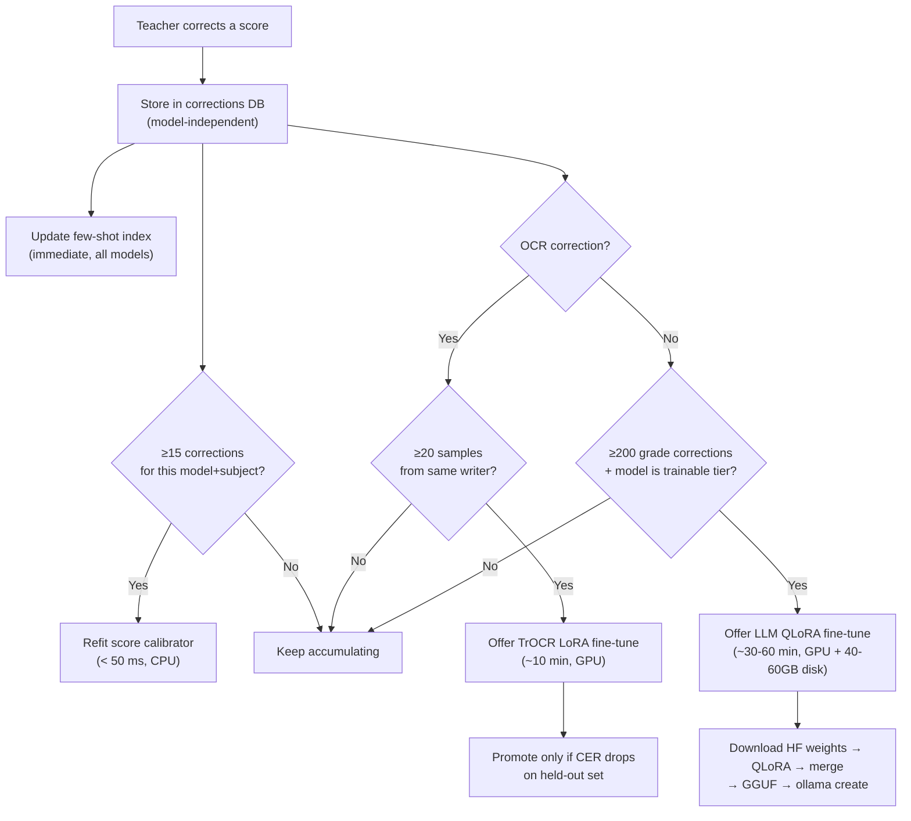
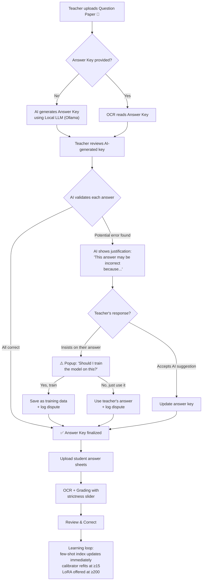
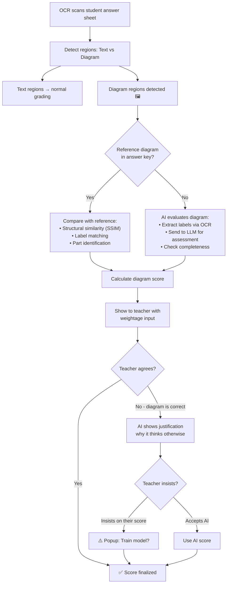
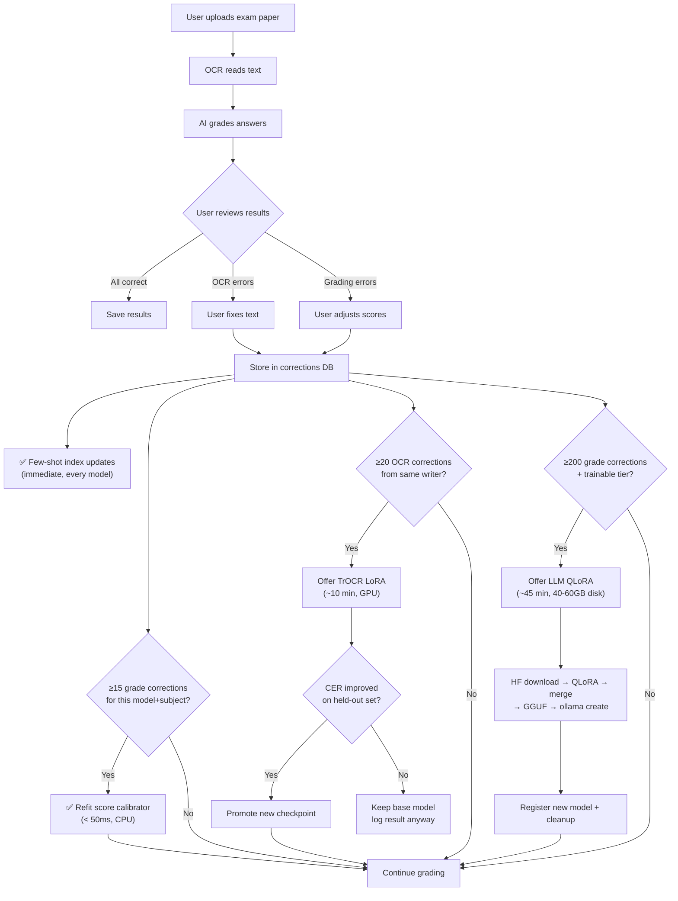

# 🎓 AI Exam Paper Evaluator — "PaperMind"

> [!IMPORTANT]
> **Privacy guarantee: student data never leaves the machine.** Question papers, answer sheets, scores, corrections, and dispute logs are processed and stored 100 % locally. Model weights and metadata are downloaded from Ollama and HuggingFace; once on disk, the entire grading pipeline runs with the network cable unplugged. Cloud LLM usage is opt-in, clearly marked, and requires explicit consent before any exam data is sent. A school or university can deploy PaperMind where an API-wrapper tool would be disqualified.

## Project Summary

**What it does:**
1. Teacher uploads **question paper** (mandatory) and optionally an **answer key**
2. If no answer key → AI **generates one** using a local LLM for teacher review
3. Teacher reviews AI-generated key — AI **validates teacher's answers** and flags potential errors with justification
4. If teacher disagrees with AI → dispute is logged with teacher name, date/time, and full conversation
5. AI reads student answer sheets using fine-tunable OCR (TrOCR)
6. AI evaluates answers with configurable strictness (0–100 slider)
7. User reviews results and corrects any mistakes
8. System stores corrections and learns from them via **four independent mechanisms** — it improves over time

**Why interviewers will love it:**
- Covers **Computer Vision, NLP, Transfer Learning, Active Learning, Local LLM, Full-Stack**
- **AI-Teacher collaboration** with dispute resolution and audit trails
- No model whitelist — runtime model identification, HuggingFace source resolution, and local architecture gating mean post-release models work automatically
- **Four-mechanism learning** where three work on every model, including ones that can never be fine-tuned
- Demonstrates understanding of **real ML pipelines**, not just API wrappers

---

## Hardware Compatibility

| Resource | Available | Required (Inference) | Required (Training) | Status |
|---|---|---|---|---|
| GPU | RTX 4060 8GB | ~5–7 GB VRAM | ~6–8 GB VRAM (QLoRA) | ✅ Excellent |
| RAM | 32GB | 16GB+ | 16GB+ | ✅ More than enough |
| Disk | 252GB | ~15 GB (models + data) | +40–60 GB transient per training run | ⚠️ Fits ~3–4 trained models |
| CUDA | Needs install | Required for GPU inference | Required for GPU training | ⚠️ Will set up |

> [!WARNING]
> **Training VRAM ≠ inference VRAM.** Inference loads quantised GGUF weights (~5 GB for a 12B Q4 model). Training needs the original fp16/bf16 HuggingFace weights plus activations, gradients, and optimizer state under QLoRA. On your 8 GB RTX 4060, QLoRA tops out around 12–14B parameters locally; anything larger must route to the Colab/Kaggle export path. The **Train** button is gated on both `torch.cuda.mem_get_info()` and `shutil.disk_usage()` — it refuses to start if resources are insufficient.

---

## Tech Stack

| Component | Technology | Why This Choice |
|---|---|---|
| **Backend** | Python 3.11 + FastAPI | Industry standard for ML, REST API serving |
| **Frontend** | React + Vite + Tailwind CSS | Modern, fast, impressive for interviews |
| **LLM Interface** | **LiteLLM** | One unified API for all models — Ollama, OpenAI, Gemini, Claude, etc. |
| **Local Models** | Ollama (serves GGUF) | Swappable models, runs offline on GPU |
| **Cloud Models** | OpenAI / Google Gemini / Anthropic / any API | User provides their own API key — opt-in, clearly marked |
| **OCR Model** | TrOCR (`trocr-base-handwritten`) | Fixed component, fine-tunable with LoRA, proven for handwriting |
| **Image Processing** | OpenCV + Pillow | Preprocessing scans for better OCR |
| **Answer Grading** | sentence-transformers | Semantic similarity, runs locally, ~100 MB |
| **Keyword Check** | KeyBERT | Extract & match key concepts |
| **Database** | SQLite | Zero config, stores corrections + dispute logs + resolution cache |
| **ML Framework** | PyTorch + HuggingFace | Industry standard, great ecosystem |
| **Fine-tuning** | **Unsloth** + QLoRA | 2–5× faster, 60 % less VRAM; training is optional, not the only learning path |

### Why LiteLLM and NOT LangChain?

> [!IMPORTANT]
> **We deliberately chose NOT to use LangChain/LangGraph.** Here's why:

| | ❌ LangChain | ✅ LiteLLM (Our Choice) |
|---|---|---|
| **Size** | 100+ sub-dependencies, heavy | Lightweight, single package |
| **Abstraction** | Hides how things work | You see & control everything |
| **Interview impression** | *"You just used a framework"* | *"I built the pipeline, LiteLLM just handles API calls"* |
| **What it does** | Chains, agents, memory, tools... | **ONE thing well**: unified API to call any LLM |
| **Learning curve** | High, constantly changing API | Minimal — 3 lines of code to call any model |

**LiteLLM in action — same code for LOCAL and CLOUD:**

```python
from litellm import completion

# Local model (Ollama) — no API key needed
response = completion(
    model="ollama/gemma3:12b",
    messages=[{"role": "user", "content": "Answer this question..."}]
)

# Cloud model (OpenAI) — user provides API key
response = completion(
    model="gpt-4o",
    api_key=user_api_key,
    messages=[{"role": "user", "content": "Answer this question..."}]
)

# Cloud model (Google Gemini)
response = completion(
    model="gemini/gemini-2.5-flash",
    api_key=user_api_key,
    messages=[{"role": "user", "content": "Answer this question..."}]
)

# SAME code. SAME interface. Just change the model name.
```

> [!TIP]
> In interviews, you can say: *"I evaluated LangChain but chose LiteLLM because I wanted to build the orchestration pipeline myself to deeply understand the architecture, while using LiteLLM only for the model interface layer. This kept dependencies minimal and let me support 100+ models with zero code changes."*
>
> This shows **engineering judgment** — knowing when NOT to use a framework is as impressive as knowing when to use one.

---

## Network & Privacy Model

> [!IMPORTANT]
> **Design principle:** student data never leaves the machine. Model infrastructure touches the network; grading never does.

| What | Touches the network? | Why |
|---|---|---|
| Model discovery (Ollama list, HF API) | ✅ Yes | Fetching metadata about available models |
| Model weight download | ✅ Yes | One-time download via `ollama pull` or HF |
| HF training-source resolution | ✅ Yes | Finding the fp16 weights for fine-tuning |
| Cloud LLM inference (opt-in) | ✅ Yes, with explicit consent | User chooses to use API, privacy warning shown |
| OCR → grading → correction → few-shot → calibration | ❌ **Never** | All local. No `requests` import anywhere under `src/grading/` or `src/ocr/` |
| Corrections DB, dispute logs, scores | ❌ **Never** | Stored in local SQLite |

**Enforced structurally** — `src/grading/` and `src/ocr/` have no network dependencies. Once weights are on disk, the whole grading pipeline runs air-gapped.

---

## The Four Learning Mechanisms

> [!IMPORTANT]
> **Design principle:** model-agnosticism lives at the interface layer; learning lives at the data layer. They never touch. Corrections are stored as **teacher intent** — `(question, answer, correct_score, note)` — never as gradients bound to one model's weights. The corrections database is the permanent asset; every fine-tune is a disposable artifact regenerated from it.

| # | Mechanism | Works on | Needs | Effect |
|---|---|---|---|---|
| 1 | **Dynamic few-shot retrieval** | Every model, always | Nothing — active from correction #1 | Past corrections are embedded and retrieved as few-shot examples in every grading prompt. This is how *any* model — including Claude, GPT, or a brand-new Ollama model — learns the teacher's marking style. |
| 2 | **Score calibration** (isotonic regression, per-model) | Every model, always | ≥15 corrections, fits in <50 ms on CPU | Learns the systematic bias between a specific model's raw scores and teacher-assigned scores. Per model, per subject. |
| 3 | **TrOCR LoRA fine-tuning** | Always — TrOCR is a fixed component users can't swap | GPU, ~10 min, 20–50 corrections from one writer | Improves handwriting recognition accuracy. Only promotes the new checkpoint if CER (Character Error Rate) actually drops on a held-out set — otherwise the "it learns!" demo silently makes accuracy *worse*. Base-vs-tuned CER is logged and surfaced as a chart either way. |
| 4 | **LLM weight fine-tuning** (QLoRA via Unsloth) | Only models with resolvable HF safetensors + supported architecture | GPU + 40–60 GB disk + ≥200 corrections | The full pipeline: download HF weights → QLoRA train with Unsloth → merge adapters → convert to GGUF via `llama.cpp` → `ollama create`. Powerful but expensive; mechanisms 1–3 cover you until you have enough data. |



> [!NOTE]
> **LoRA adapters do not transfer between models.** Different architectures have different tensor shapes, layer counts, and tokenizers. Switching models means retraining from base on the full correction set, not migrating adapter weights. This is why the corrections DB (teacher intent) is the permanent asset, and every fine-tune is a disposable artifact regenerated from it.

#### [NEW] `src/learning/correction_retriever.py`

```python
class CorrectionRetriever:
    """
    Embeds all past corrections with sentence-transformers.
    At grading time, retrieves top-k similar past gradings and
    injects them as few-shot examples into the grading prompt.
    
    This is how ANY model — including Claude/GPT which can never
    be fine-tuned locally — learns the teacher's marking style.
    
    Stored vectors include embedder_name and embedder_version columns.
    On load, if the current embedder doesn't match the stored vectors,
    the index is automatically rebuilt — prevents silent garbage
    retrievals when the user switches e.g. MiniLM → mpnet (different
    dimensionality, different space).
    """
    
    def add_correction(self, question: str, answer: str, 
                       correct_score: float, note: str):
        """Embed and index a new correction (immediate, <100ms).
        Stores: embedding + embedder_name + embedder_version."""
    
    def retrieve(self, question: str, answer: str, k: int = 5) -> list[Correction]:
        """Find the k most similar past corrections for few-shot prompting.
        Raises EmbedderMismatch if stored vectors don't match current model."""
    
    def rebuild_index(self):
        """Re-embed all corrections with the current embedder.
        Called automatically on embedder mismatch."""
    
    def build_few_shot_prompt(self, question: str, answer: str, 
                               rubric: str) -> str:
        """Construct grading prompt with retrieved examples:
        'Here is how this teacher graded similar answers:
         Q: ... A: ... Score: 7/10 Note: ...'
        """
```

#### [NEW] `src/learning/score_calibrator.py`

```python
class ScoreCalibrator:
    """
    Learns the systematic model-vs-teacher bias, per model, per subject.
    Uses isotonic regression: monotonic, non-parametric, fits in <50ms.
    
    Example: if Gemma 3 consistently scores 15% higher than the teacher
    on Biology answers, the calibrator adjusts future scores down.
    """
    
    def fit(self, model_scores: list[float], teacher_scores: list[float]):
        """Fit calibration curve. Requires ≥15 data points."""
    
    def calibrate(self, raw_score: float) -> float:
        """Apply calibration to a raw model score"""
    
    def get_bias_report(self) -> BiasReport:
        """Show teacher how this model's scoring tendency compares to theirs"""
```

### Migration on Model Switch

When switching to a different model, the experience depends on the model's tier:

**For all models (instant, free):**
- Rebuild few-shot retrieval index with new embedding (seconds)
- Refit score calibrator from stored corrections (< 50 ms)
- **Result: 3 of 4 learning mechanisms active immediately**

**For trainable-tier models only (optional, expensive):**
- Offer QLoRA retraining with honest estimates:
  ```
  "You have 247 stored corrections. Retraining this model requires:
   • ~45 GB free disk space (you have 180 GB free ✅)
   • ~45 minutes on your RTX 4060
   • The training VRAM is ~7.2 GB (you have 8 GB ✅)
   
   [ 🔄 Retrain from all corrections ]
   [ ⏭️ Skip — few-shot + calibration are already active ]"
  ```

---

## Model Resolution — Three-Layer Dynamic Chain

> [!IMPORTANT]
> We do NOT maintain a model whitelist. The system identifies, classifies, and gates models at runtime through three resolution layers. A model released next year reports its own architecture string via GGUF metadata — zero code changes required.

### Layer 1 — Identify the model from Ollama

`POST /api/show` returns everything we need to classify a model without a static registry:

```python
class OllamaModelProbe:
    """Extract capabilities from Ollama's model metadata — no hardcoded lists."""
    
    def probe(self, model_name: str) -> ModelIdentity:
        """
        POST http://localhost:11434/api/show { "model": model_name }
        
        Extracts from response:
        - details.parameter_size     → "12B"
        - details.quantization_level → "Q4_K_M"  
        - details.family             → "gemma3"
        - capabilities[]             → ["vision", "tools", ...]
        - model_info["general.architecture"]    → "gemma3"
        - model_info["general.parameter_count"] → 12_000_000_000
        - model_info["<arch>.context_length"]   → 131072
        
        VRAM, modality, context length and parameter count are all
        detected, never hardcoded. Delete these fields from any
        static registry.
        """
```

### Layer 2 — Resolve the HuggingFace training source

GGUF is an inference-only quantised format — no backward pass. Fine-tuning requires the original fp16/bf16 safetensors from HuggingFace. This layer finds them automatically:

```python
class HFSourceResolver:
    """
    Given an Ollama model's family + parameter count, find the
    original HuggingFace repo with trainable safetensors.
    """
    
    def resolve(self, identity: ModelIdentity) -> HFResolution:
        """
        1. Query https://huggingface.co/api/models?search={family}
        2. Filter out repos with no .safetensors files
        3. Rank candidates:
           - Bonus: official org (google, meta-llama, Qwen, microsoft)
           - Bonus: matching size label + instruct suffix
           - Heavy penalty: gguf/awq/gptq/bnb/exl2/mlx re-uploads
        4. Verify: compare config.json parameter_count against
           Ollama's reported count within ±15%
        5. Return resolved repo + confidence level
        """
    
    # Resolution is cached in SQLite with 30-day TTL.
    # Manual re-resolve button in Settings.
    # Optional HF token field lifts rate limit + unlocks gated repos.
```

**In the UI:** Show the resolved repo and confidence with a "Not right?" manual override link. Log which repo each checkpoint was trained from.

### Layer 3 — Gate on the local environment

The real trainability check is whether the installed `transformers` library can load the architecture:

```python
class ArchitectureGate:
    """
    Gate fine-tuning on actual library support, not on a list.
    """
    
    def check(self, hf_repo: str) -> TrainabilityResult:
        """
        1. AutoConfig.from_pretrained(hf_repo)
        2. Check config.model_type in CONFIG_MAPPING_NAMES
        3. If it fails, produce an actionable error:
           'transformers 4.61 doesn't know "gemma4" yet — 
            try: pip install -U transformers unsloth'
        
        This is what makes the system genuinely future-proof.
        """
```

### Override registry (small, remote, patches only)

A small JSON file hosted on GitHub raw, fetched at startup, cached to SQLite. **Not a catalogue** — just a handful of entries to patch cases auto-resolution gets wrong (e.g., a model whose HF repo has an unusual name).

### Example models auto-resolution finds today (not a supported-models list)

These are examples of what the resolution chain discovers on current hardware. The system works with whatever Ollama serves:

#### 🧠 LLM (examples — auto-discovered, not hardcoded)

| Model | Params | VRAM (inference Q4) | VRAM (QLoRA training) | Vision | Trainable? |
|---|---|---|---|---|---|
| **Gemma 3 12B** | 12B | ~7 GB | ~8+ GB (OOM risk) | ✅ Yes | ⚠️ Routes to Kaggle/Colab for training |
| **Qwen 3 8B** | 8B | ~5 GB | ~6 GB | ❌ | 🟢 ⭐ Recommended trainable target |
| **Phi-4 Mini** | 3.8B | ~2.5 GB | ~3.5 GB | ❌ | 🟢 If HF weights resolve |
| **DeepSeek R1 Distill 8B** | 8B | ~5 GB | ~6 GB | ❌ | 🟢 If HF weights resolve |
| **Llama 3.1 8B** | 8B | ~5 GB | ~6 GB | ❌ | 🟢 (gated — needs HF token) |
| **Gemma 3 4B** | 4B | ~2.5 GB | ~3.5 GB | ✅ Yes | 🟢 Vision + trainable locally |

> [!WARNING]
> **RTX 4060 reality:** Windows desktop compositing reserves ~0.8 GB, leaving ~7.2 GB usable. Gemma 3 12B's vision tower adds parameters that QLoRA must hold — training will likely OOM. **Use Qwen 3 8B or Gemma 3 4B for local QLoRA.** Gemma 3 12B is great for inference but routes to Kaggle/Colab for training. Anything above 14B also routes to Colab/Kaggle.

#### 📸 For OCR (Reading Handwritten Text)

| Model | Type | VRAM | Fine-tunable |
|---|---|---|---|
| **TrOCR** (`trocr-base-handwritten`) | Dedicated OCR | ~1.3 GB disk / ~2 GB train VRAM | ✅ Always (LoRA, fixed component) |

> TrOCR is a **fixed component** of PaperMind, not user-swappable. This simplifies the OCR learning loop — LoRA fine-tuning always works because TrOCR's HF weights are always available and its architecture is always supported.

#### 📊 For Sentence Similarity (Grading)

| Model | Size | Speed |
|---|---|---|
| **all-MiniLM-L6-v2** | 80 MB | Very fast |
| **all-mpnet-base-v2** | 420 MB | More accurate, slightly slower |
| **BGE-small-en-v1.5** | 130 MB | Good balance |

---

## Capability Probe — Testing Models Before Use

#### [NEW] `src/models/capability_prober.py`

When a user selects a newly discovered model, a ~30-second self-test runs before letting it into the grading pipeline:

```python
class CapabilityProber:
    """
    Runs a battery of tests on a new model before it enters
    the grading pipeline. Results are cached per model.
    """
    
    def probe(self, model_name: str) -> ProbeReport:
        """
        Runs ~30 seconds of tests:
        
        1. JSON adherence — can it return valid JSON consistently?
        2. Instruction following — does it obey formatting rules?
        3. Rubric reasoning — grade a known 5-mark case, 
           check score is in a sane range (±1.5 of expected)
        4. Vision (optional) — send a test image, check response.
           Determines whether diagram evaluation can use the LLM's
           visual judgement (Phase 4) in addition to SSIM + label
           matching. Failure degrades diagram scoring to the
           geometric/label-only path; OCR is unaffected, since
           TrOCR is fixed.
        5. Long-context needle retrieval (optional) — 
           test if it handles full-paper context.
        
        Returns per-probe pass/fail + overall tier.
        """
    
    def assign_tier(self, report: ProbeReport, 
                    hf_resolved: bool) -> ModelTier:
        """
        🟢 Trainable: probes pass + HF source resolved + 
                       architecture supported by transformers
        🟡 Inference-only: probes pass but weights can't be 
                           fine-tuned (still learns via few-shot 
                           + calibration — 3 of 4 mechanisms active)
        🔴 Incompatible: failed critical probes (JSON, instruction 
                         following, or rubric reasoning)
        """
```

**UI — Model Capability Card:**

```
┌─────────────────────────────────────────────────┐
│  Gemma 3 12B (Q4_K_M)                    🟢     │
│                                                  │
│  JSON adherence:        ✅ Pass                  │
│  Instruction following: ✅ Pass                  │
│  Rubric reasoning:      ✅ Pass (scored 4.0/5)   │
│  Vision:                ✅ Pass → diagram visual scoring enabled │
│  Long-context:          ✅ Pass (128K ctx)         │
│                                                  │
│  HF Source: google/gemma-3-12b-it  [✅ resolved] │
│  Architecture: gemma3  [✅ supported]            │
│                                                  │
│  Tier: 🟢 Trainable                             │
│                                                  │
│  Learning status (247 corrections):              │
│  ✅ Few-shot retrieval    active (247 examples)  │
│  ✅ Score calibration     active (bias: -4.2%)   │
│  ✅ TrOCR fine-tuning     trained (v3, CER ↓12%) │
│  ✅ LLM weight fine-tune  available (offer)      │
│                                                  │
│  Corrections are YOUR permanent asset —          │
│  they work across every model you try.           │
└─────────────────────────────────────────────────┘
```

For a 🟡 tier model the card reads: *"3 of 4 learning mechanisms active. LLM weight fine-tuning unavailable for this model (no resolvable HF weights). Few-shot retrieval + score calibration provide continuous learning."*

---

## Structured-Output Robustness

> [!WARNING]
> **This is the actual thing that breaks model-agnosticism in practice.** An arbitrary small model will return markdown fences, preambles, or invalid JSON, and the grading loop will crash mid-batch. Four defence layers prevent this:

| Layer | What it does | When it fires |
|---|---|---|
| **1. Native constrained decoding** | Ollama's `format` parameter / JSON schema, feature-detected via LiteLLM's `response_format`. **Never assumed** — the probe checks if the model actually respects it. | Always attempted first |
| **2. Tolerant parser** | Strip markdown fences (\`\`\`json), brace-match the outermost `{...}` object, ignore preambles/postambles. | If raw response isn't valid JSON |
| **3. Repair turn** | Send the broken output back to the model: *"Your response was not valid JSON. Return ONLY the JSON object."* Max 2 retries. | If tolerant parser fails |
| **4. Degraded fallback** | Mark `reliable_json=False` on this model. Route to a regex-extractable plain-text format: `SCORE: 3.5 \n FEEDBACK: Good answer but...` | If all else fails |

```python
class OutputParser:
    """Four-layer defence against malformed model output."""
    
    def parse_grading_response(self, raw: str, model_name: str) -> GradingResult:
        # Layer 1: Try json.loads(raw)
        # Layer 2: strip_fences(raw) → brace_match(raw) → json.loads
        # Layer 3: send repair prompt, retry up to 2x
        # Layer 4: regex extract SCORE: and FEEDBACK:, set reliable_json=False
```

---

## Model Selector / Switcher

Users can swap models from the UI. The list is **populated dynamically** from Ollama — never hardcoded.

#### [NEW] `src/models/model_manager.py`

```python
class ModelManager:
    """
    Manages all AI models — users can switch models from the settings page.
    Uses the 3-layer resolution chain to identify and classify models.
    """
    
    def list_installed_models(self) -> list[ModelInfo]:
        """Query 'ollama list' → probe each → return with tier + capabilities"""
    
    def switch_llm(self, model_name: str) -> bool:
        """Switch the active LLM. Runs capability probe if first use.
        Rebuilds few-shot index + refits calibrator (instant).
        Does NOT auto-trigger weight fine-tuning."""
    
    def download_model(self, model_name: str, callback) -> None:
        """Download a new model via Ollama with progress callback"""
    
    def get_vram_usage(self) -> VRAMReport:
        """Show current GPU memory usage breakdown"""
    
    def recommend_models(self, gpu_vram: int) -> list[ModelConfig]:
        """Auto-recommend the best model combo for user's hardware"""
```

#### React Settings Page (in UI)

```
┌─────────────────────────────────────────────────────────────┐
│  ⚙️ Model Settings                                         │
│                                                             │
│  GPU: NVIDIA RTX 4060 — 8 GB VRAM                          │
│  ████████████████████░░░░  6.5 / 8.0 GB used               │
│                                                             │
│  ┌─────────────────────────────────────────────────────┐    │
│  │ 🧠 LLM Model (Answer Generation & Validation)      │    │
│  │                                                     │    │
│  │  ● Gemma 3 12B (Q4)     ~7.0 GB  🟢 Trainable     │    │
│  │  ○ Qwen 3 8B (Q4)       ~5.0 GB  🟢 Trainable     │    │
│  │  ○ Phi-4 Mini            ~2.5 GB  🟡 Inference     │    │
│  │                                                     │    │
│  │  [ Apply ]  [ Run Probe ]                           │    │
│  └─────────────────────────────────────────────────────┘    │
│                                                             │
│  ┌─────────────────────────────────────────────────────┐    │
│  │ 📊 Embedding Model (Answer Similarity)              │    │
│  │                                                     │    │
│  │  ● all-MiniLM-L6-v2      ~80 MB   ✅ Fast           │    │
│  │  ○ all-mpnet-base-v2     ~420 MB  More accurate     │    │
│  │                                                     │    │
│  │  [ Apply ]                                          │    │
│  └─────────────────────────────────────────────────────┘    │
│                                                             │
│  HuggingFace Token: [ hf_●●●●●●●● ] (optional, for gated  │
│                       repos + higher API rate limit)        │
│                                                             │
│  [ 🔍 Auto-Detect Best Config ]   [ 📥 Download All ]      │
└─────────────────────────────────────────────────────────────┘
```

**Features:**
- **Auto-detect GPU** → recommend optimal model combination
- **VRAM calculator** → shows if a model will fit before loading (separate inference vs training figures)
- **One-click download** via Ollama with progress bar
- **Hot-swap** — switch models without restarting the app
- **Capability probe** — test a model before trusting it with grading
- **Tier badges** — 🟢 Trainable / 🟡 Inference-only at a glance

### Corrections Persistence — Model-Independent by Design

```
┌─────────────────────────────────────────────────────────┐
│  Corrections Database (PERMANENT, model-free)           │
│                                                         │
│  All corrections stored as TEACHER INTENT:              │
│  ┌─────────────────────────────────────────────────┐    │
│  │ (question, student_answer, correct_score, note) │    │
│  │ (image_region, correct_text)          — for OCR │    │
│  │ (diagram, correct_evaluation)    — for diagrams │    │
│  │ (dispute_history)             — full audit trail │    │
│  └─────────────────────────────────────────────────┘    │
│  Never gradients. Never model-specific.                 │
│  These NEVER get deleted. They are your training gold.  │
└─────────────────────────────────────────────────────────┘
             │
    Used by ALL four learning mechanisms:
    ├─ Few-shot retrieval (immediate, all models)
    ├─ Score calibrator (≥15 corrections, all models)
    ├─ TrOCR LoRA (≥20 OCR corrections)
    └─ LLM QLoRA (≥200 corrections, trainable tier only)
```

### ☁️ Cloud API Support — Use Any Provider with Your API Key

Not everyone has a GPU. PaperMind supports **both local AND cloud** seamlessly via LiteLLM.

#### [NEW] `src/models/cloud_provider.py`

```python
class CloudProvider:
    """
    Manages cloud API connections.
    User provides their own API key — stored locally, encrypted.
    """
    
    def validate_api_key(self, provider: str, api_key: str) -> bool:
        """Test if the API key is valid with a simple ping"""
    
    def estimate_cost(self, model: str, task: str, num_papers: int) -> CostEstimate:
        """Estimate cost BEFORE running:
        'Grading 30 papers with gpt-4o will cost approximately $0.45'"""
```

> [!NOTE]
> Cloud models (GPT, Claude, Gemini) **can never be fine-tuned locally** — but they still benefit from mechanisms 1 and 2: few-shot retrieval injects teacher corrections into every prompt, and score calibration adjusts for the model's systematic bias. The system never promises weight fine-tuning for cloud models.

#### React API Key Settings UI

```
┌─────────────────────────────────────────────────────────────┐
│  ☁️ Cloud API Settings                                      │
│                                                             │
│  ┌─── Provider ──────────────────────────────────────┐      │
│  │  ● 🏠 Local (Ollama) — Free, private, no internet │      │
│  │  ○ ☁️ Cloud API — Requires explicit consent        │      │
│  └────────────────────────────────────────────────────┘      │
│                                                             │
│  Provider:  [ OpenAI      ▼ ]                               │
│  API Key:   [ sk-●●●●●●●●●●●●●●●●aBcD ]  [👁️] [Test ✅]    │
│  Model:     [ gpt-4o      ▼ ]                               │
│                                                             │
│  ┌─── Privacy & Cost ────────────────────────────────┐      │
│  │  ⚠️ Cloud mode sends exam data to the provider.   │      │
│  │  Estimated cost for 30 papers: ~$0.45              │      │
│  │                                                    │      │
│  │  [✓] I understand student data leaves my machine   │      │
│  └────────────────────────────────────────────────────┘      │
│                                                             │
│  Learning: Few-shot + calibration are active.               │
│  Weight fine-tuning: Not available for cloud models.        │
│                                                             │
│  [ Save Settings ]                                          │
└─────────────────────────────────────────────────────────────┘
```

### LLM Weight Fine-Tuning — The Real Pipeline

> [!WARNING]
> **Ollama serves GGUF — an inference-only quantised format with no backward pass.** Fine-tuning requires the original fp16/bf16 safetensors from HuggingFace. The full pipeline is:
>
> `Download HF weights → QLoRA train with Unsloth → merge adapters → convert to GGUF via llama.cpp → ollama create`
>
> This needs **40–60 GB of transient disk** per training run (HF weights + merged model + GGUF conversion artifacts), cleaned up after the new GGUF is registered.

#### ⚡ Unsloth — Making QLoRA Viable on Consumer Hardware

| | Without Unsloth | **With Unsloth** |
|---|---|---|
| **Speed** | 1x (baseline) | **2–5× faster** |
| **VRAM** | ~6–8 GB for 8B model | **~3–4 GB** (60 % less) |
| **Practical ceiling on RTX 4060** | ~8B parameters | **~12–14B parameters** |
| **Cost** | Free | **Free** |

```python
from unsloth import FastLanguageModel

model, tokenizer = FastLanguageModel.from_pretrained(
    model_name="unsloth/gemma-3-12b-bnb-4bit",
    max_seq_length=2048,
    load_in_4bit=True,
)

model = FastLanguageModel.get_peft_model(model, r=16, lora_alpha=16)
# Train with HuggingFace Trainer as normal
# Then: merge → convert to GGUF → ollama create
```

#### Free Cloud GPUs — For Models Exceeding Local Ceiling

| Platform | GPU | VRAM | Free Limit | Best For |
|---|---|---|---|---|
| **Google Colab** | T4 | **15 GB** | ~12hr sessions | Models 14B+ that don't fit locally |
| **Kaggle** | T4 ×2 | **30 GB** | 30 hrs/week | Heavy training, large datasets |
| **Lightning.ai** | Various | Varies | Free credits | Quick experiments |

#### [NEW] `src/models/training_router.py`

```python
class TrainingRouter:
    """Decides WHERE to fine-tune based on model size and available resources."""
    
    def get_training_plan(self, model_name: str, 
                          num_corrections: int) -> TrainingPlan:
        """
        Checks:
        1. Is this model trainable tier? (HF resolved + arch supported)
        2. Enough corrections? (≥200 for LLM, ≥20 for TrOCR)
        3. Enough disk? (shutil.disk_usage — need 40-60GB free)
        4. Enough VRAM? (torch.cuda.mem_get_info — training VRAM)
        
        Routes to:
        - Local Unsloth (if resources sufficient)
        - Export Colab/Kaggle notebook (if model too large)
        - Refuse with explanation (if not trainable tier)
        """
    
    def export_colab_notebook(self, model: str, corrections: list) -> str:
        """Generate a ready-to-run Colab notebook with Unsloth setup,
        training data pre-loaded, and instructions to download the
        resulting GGUF back to local Ollama."""
```

**User flow in the UI:**

```
┌─────────────────────────────────────────────────────────────┐
│  🔄 Fine-Tune Model — 247 corrections available            │
│                                                             │
│  Current model: Qwen 3 8B (Q4) — 🟢 Trainable              │
│                                                             │
│  Already active (no training needed):                       │
│  ✅ Few-shot retrieval    247 examples indexed               │
│  ✅ Score calibration     bias: -4.2% (auto-adjusted)        │
│  ✅ TrOCR LoRA            v3, CER improved 12%               │
│                                                             │
│  Optional — LLM weight fine-tuning:                          │
│                                                             │
│  ● 🏠 Local (Unsloth + RTX 4060)    ⭐ Recommended          │
│    └ ~45 min • Free • Private                                │
│    └ VRAM: 5.8/7.2 GB usable ✅                              │
│    └ Disk: needs 48 GB (you have 180 GB free ✅)             │
│                                                             │
│  ○ 📓 Google Colab (Free T4 GPU)                            │
│    └ ~30 min • Free • Requires Google login                  │
│    └ [ Export Notebook 📥 ]                                  │
│                                                             │
│  [ 🚀 Start Training ]                                      │
└─────────────────────────────────────────────────────────────┘

If the user had Gemma 3 12B selected instead:

┌─────────────────────────────────────────────────────────────┐
│  🔄 Fine-Tune Model — 247 corrections available            │
│                                                             │
│  Current model: Gemma 3 12B (Q4) — ⚠️ Inference-only local │
│                                                             │
│  Already active (no training needed):                       │
│  ✅ Few-shot retrieval    247 examples indexed               │
│  ✅ Score calibration     bias: -3.8% (auto-adjusted)        │
│  ✅ TrOCR LoRA            v3, CER improved 12%               │
│                                                             │
│  Optional — LLM weight fine-tuning:                          │
│                                                             │
│  ✖ 🏠 Local — blocked (needs ~8+ GB, you have 7.2 GB)      │
│                                                             │
│  ● 📓 Kaggle (Free T4 ×2, 30 GB)    ⭐ Recommended          │
│    └ ~30 min • Free • 30 hrs/week limit                      │
│    └ [ Export Notebook 📥 ]                                  │
│                                                             │
│  ○ 📓 Google Colab (Free T4 GPU)                            │
│    └ ~30 min • Free • Requires Google login                  │
│    └ [ Export Notebook 📥 ]                                  │
│                                                             │
│  [ 🚀 Start Training ]                                      │
└─────────────────────────────────────────────────────────────┘
```

#### [NEW] `src/models/checkpoint_gc.py`

At 40–60 GB per trained model, 252 GB holds only 3–4 checkpoints. Automatic cleanup:

```python
class CheckpointGC:
    """Garbage-collects old training artifacts and GGUF conversions."""
    
    def collect(self, keep_latest_n: int = 2):
        """Keep the 2 most recent checkpoints per model, delete the rest.
        Also clean up transient HF weights and conversion artifacts
        after a successful ollama create."""
    
    def get_disk_report(self) -> DiskReport:
        """Show: checkpoints: 98GB, transient: 0GB, free: 154GB"""
```

---

## Architecture

```
┌──────────────────────────────────────────────────────────────────────┐
│                        REACT + VITE UI                               │
│  ┌───────────┐ ┌──────────────┐ ┌─────────────┐ ┌──────────────┐   │
│  │  Upload    │ │ Answer Key   │ │  Grade &    │ │  Analytics   │   │
│  │  Q.Paper   │ │ Review &     │ │  Review     │ │  & Dispute   │   │
│  │  + Key     │ │ Dispute      │ │  + Correct  │ │  Logs        │   │
│  └─────┬──── ┘ └──────┬───────┘ └──────┬──────┘ └──────────────┘   │
│  🎚️ Strictness Slider (0-100)          │                            │
└────────┼───────────────┼────────────────┼───────────────────────────┘
         │               │                │
         ▼               ▼                ▼
┌──────────────┐  ┌─────────────────┐  ┌──────────────────────┐
│  OCR Pipeline │  │  Knowledge      │  │  Learning Layer      │
│              │  │  Engine         │  │                      │
│ OpenCV       │  │                 │  │ Corrections DB       │
│   ↓          │  │ LiteLLM        │  │ Few-shot retriever   │
│ TrOCR Model  │  │ (any provider) │  │ Score calibrator     │
│   ↓          │  │   ↓             │  │ TrOCR LoRA trainer   │
│ Text Output  │  │ Generate Keys   │  │ LLM QLoRA trainer    │
└──────┬───────┘  │ Validate Ans    │  │ (optional)           │
       │          │ Justify Errors  │  └──────────┬───────────┘
       ▼          └────────┬────────┘             │
┌──────────────┐           │            ┌─────────────────────┐
│   Grading    │◄──────────┘            │  Model Management   │
│   Engine     │                        │                     │
│              │                        │ Ollama probe        │
│ Strictness   │                        │ HF resolver         │
│ Curve        │                        │ Architecture gate   │
│   +          │                        │ Capability prober   │
│ Sentence     │                        │ Checkpoint GC       │
│ Similarity   │                        └─────────────────────┘
│   +          │
│ Few-shot     │
│ retrieval    │
│   +          │
│ Calibration  │
│   ↓          │
│ Score + Why  │
└──────────────┘
```

### Core Flow



---

## Proposed Changes — Phase-by-Phase Build

We'll build this in **8 phases**, each adding a working feature. You'll have a **demo-able project after Phase 3** (can grade papers), and the **full ML showcase after Phase 5**.

---

### Phase 1: Project Setup & Environment (~30 mins) — 🎯 First demo artifact

#### [NEW] `requirements.txt`
All Python dependencies pinned to compatible versions.

#### [NEW] `setup_env.py`
A helper script that verifies CUDA, installs PyTorch with GPU support, and downloads required models.

#### [NEW] `README.md`
Project documentation with setup instructions, architecture diagram, and demo screenshots.

**What you'll learn**: Python virtual environments, dependency management, CUDA setup.

**Demo artifact**: Environment verified, TrOCR model downloaded, Ollama running.

---

### Phase 2: Image Processing & OCR Pipeline (~2-3 hours) — 🎯 "It can read handwriting"

#### [NEW] `src/ocr/preprocessing.py`
Image preprocessing pipeline using OpenCV:
- Convert to grayscale
- Noise removal (Gaussian blur, morphological operations)
- Binarization (adaptive thresholding)
- Deskewing (straighten tilted scans)
- Line/question segmentation (split paper into individual answers)

#### [NEW] `src/ocr/text_extractor.py`
TrOCR-based text extraction:
- Load pre-trained `microsoft/trocr-base-handwritten` model
- Process each segmented answer region
- Return extracted text with confidence scores
- GPU-accelerated inference

#### [NEW] `src/ocr/pipeline.py`
End-to-end OCR pipeline that chains preprocessing → segmentation → extraction.

**What you'll learn**: OpenCV basics, HuggingFace model loading, GPU inference, image segmentation.

**Demo artifact**: Upload a photo of handwriting → see extracted text.

---

### Phase 3: Answer Evaluation & Grading Engine (~3-4 hours) — 🎯 "It can grade papers"

#### [NEW] `src/grading/answer_key.py`
Answer key management:
- Load answer keys from JSON/YAML files
- Support for MCQ answers, short answers, and descriptive answers
- Per-question marks allocation

#### [NEW] `src/grading/mcq_grader.py`
MCQ grading logic:
- Direct string matching after normalization
- Handle common OCR mistakes (O vs 0, l vs 1)
- Return correct/incorrect with marks

#### [NEW] `src/grading/strictness_curve.py` ⭐
**Strictness Slider** — a scoring curve that controls how leniently or strictly answers are graded.

**UI**: A slider from **0 (very lenient)** to **100 (very strict)**.

**How it works mathematically:**

```python
def apply_strictness(similarity: float, strictness: int) -> float:
    """
    Maps raw similarity score to final marks percentage
    using a power curve controlled by strictness.
    
    strictness: 0 (lenient) to 100 (strict)
    """
    # Map strictness 0-100 → exponent 0.3 to 2.5
    exponent = 0.3 * (8.33 ** (strictness / 100.0))
    
    # Apply power curve
    marks_ratio = similarity ** exponent
    
    return marks_ratio
```

**Example: Student answer has 70% semantic similarity**

| Strictness | Label | Exponent | Marks Awarded |
|---|---|---|---|
| **0** | Very Lenient | 0.30 | **~89%** ✅ |
| **25** | Lenient | 0.51 | **~82%** |
| **50** | Medium | 0.87 | **~73%** |
| **75** | Strict | 1.47 | **~58%** |
| **100** | Very Strict | 2.50 | **~42%** |

The curve is smooth and continuous — no hard boundaries between easy/medium/hard.

```
Marks %
100│ ╲  ← Lenient (strictness=0)
   │  ╲╲
 75│   ╲ ╲  ← Medium (strictness=50)
   │    ╲  ╲
 50│     ╲   ╲  ← Strict (strictness=100)
   │      ╲    ╲
 25│       ╲     ╲
   │        ╲      ╲
  0└──────────────────
   0    25   50   75  100
          Similarity %
```

#### [NEW] `src/grading/subjective_grader.py`
Subjective answer grading using sentence-transformers + strictness curve:
- Load `all-MiniLM-L6-v2` model (~80 MB, runs fast on GPU)
- Compute cosine similarity between student answer & model answer
- Keyword presence checking using KeyBERT
- Combined raw score: 60% semantic similarity + 40% keyword coverage
- **Apply strictness curve** to transform raw score → final marks
- **Apply score calibration** if calibrator is fitted for this model
- **Inject few-shot examples** from correction retriever into grading prompt
- Return score + explanation of why

#### [NEW] `src/grading/structured_output.py`
Four-layer defence against malformed model output (see Structured-Output Robustness section above).

#### [NEW] `src/grading/grading_engine.py`
Orchestrator that routes each question to the right grader (MCQ vs subjective).

**What you'll learn**: Sentence embeddings, cosine similarity, NLP pipelines, scoring algorithms, mathematical curve design, structured output handling.

**Demo artifact**: Upload question paper + answer key + student paper → get graded results with strictness slider.

---

### Phase 4: Diagram Detection & Evaluation ⭐ (~3-4 hours) — 🎯 "It understands diagrams"

Students often draw **diagrams** in answers (biology diagrams, circuit diagrams, flowcharts, maps, etc.). PaperMind handles these too.

#### How It Works



#### [NEW] `src/diagram/detector.py`
Detect and separate diagram regions from text in answer sheets:
- Use **OpenCV contour detection** to find non-text regions
- Classify regions as: text, diagram, table, or mixed
- Techniques: adaptive thresholding, connected component analysis, area & aspect ratio filtering

```python
def detect_diagrams(answer_image: np.ndarray) -> list[DiagramRegion]:
    """
    Returns: [
        DiagramRegion(
            image=cropped_image,
            bbox=(x, y, w, h),
            confidence=0.87,
            has_labels=True,
            question_number=3
        )
    ]
    """
```

#### [NEW] `src/diagram/label_extractor.py`
Extract text labels from within diagrams using TrOCR on diagram regions.

#### [NEW] `src/diagram/evaluator.py`
Evaluate student diagrams — two modes:

**Mode 1: With Reference Diagram**
- Structural Similarity (SSIM), label matching, part completeness
- Combined score: 40% structure + 35% label accuracy + 25% completeness

**Mode 2: Without Reference (AI evaluates independently)**
- Extract labels → send to LLM with subject context → LLM evaluates completeness

#### [NEW] `src/diagram/weightage.py`
Teacher-configurable diagram weightage system:

```
┌─────────────────────────────────────────────────┐
│  📊 Diagram Weightage — Question 5              │
│                                                  │
│  Does this question have a diagram?  [✅ Yes]    │
│                                                  │
│  Diagram marks: [3] out of [10] total marks     │
│                                                  │
│  Label weight:      [40%] ████████░░             │
│  Structure weight:  [35%] ███████░░░             │
│  Completeness:      [25%] █████░░░░░             │
│                                                  │
│  Required labels (comma separated):              │
│  [Nucleus, Cell Wall, Mitochondria, ...]        │
│                                                  │
│  Reference diagram: [📎 Upload] (optional)       │
└─────────────────────────────────────────────────┘
```

Diagram disputes follow the same flow as text answers — logged with both diagram images, labels, teacher reasoning, date/time.

**What you'll learn**: Image segmentation, contour detection, SSIM, label extraction, multimodal evaluation.

---

### Phase 5: Knowledge Engine — Answer Key Generation, Validation & Dispute Resolution ⭐ (~3-4 hours) — 🎯 "AI collaborates with teachers"

This is the **teacher collaboration system** — one of the most impressive parts.

#### [NEW] `src/knowledge/llm_client.py`
LiteLLM interface to any model provider (Ollama as one backend, cloud APIs as others):
- Model-agnostic: works with any LiteLLM-supported model
- Send question → get model-generated answer
- Configurable prompts for different question types
- Structured output with 4-layer robustness (see above)
- Fallback handling if Ollama is not running

#### [NEW] `src/knowledge/answer_generator.py`
Generate complete answer keys from question papers:
- Takes OCR-extracted questions from the question paper
- Sends each question to LLM with subject context
- Generates structured answer key with answer text, key concepts, suggested marks, confidence

#### [NEW] `src/knowledge/answer_validator.py`
Validates teacher-provided answers against AI knowledge:

```python
def validate_answer(question: str, teacher_answer: str, subject: str) -> dict:
    """
    Returns: {
        "is_valid": False,
        "ai_answer": "The correct answer according to AI",
        "justification": "The teacher's answer states X, but according to 
                          [reasoning], the correct answer should be Y...",
        "confidence": 0.92,
        "sources": ["textbook concept", "standard definition"]
    }
    """
```

**The Dispute Flow:**
1. AI shows: *"⚠️ Q3: Your answer may be incorrect. [Justification with reasoning]"*
2. Teacher can: Accept AI suggestion → answer key updated / Modify their answer → re-validated / Insist on their answer → triggers dispute popup

#### [NEW] `src/knowledge/dispute_manager.py`
Handles teacher-AI disagreements:

```
┌─────────────────────────────────────────────────┐
│  ⚠️ Answer Dispute — Question 3                │
│                                                 │
│  Your answer differs from the AI's assessment.  │
│                                                 │
│  Your answer: "Photosynthesis occurs in..."     │
│  AI's answer: "Photosynthesis primarily..."     │
│  AI's reasoning: "The teacher's answer..."      │
│                                                 │
│  Would you like to:                             │
│                                                 │
│  ☐ Save my answer as a correction              │
│    (improves future grading via few-shot)       │
│                                                 │
│  ☐ Use my answer WITHOUT saving                │
│    (one-time override, AI unchanged)            │
│                                                 │
│  Teacher Name: [_______________]                │
│                                                 │
│  [ Cancel ]              [ Confirm & Log ]      │
└─────────────────────────────────────────────────┘
```

#### [NEW] `src/knowledge/dispute_logger.py`
SQLite-backed audit trail:

```python
class DisputeLog:
    id: int
    teacher_name: str
    timestamp: datetime
    question_text: str
    teacher_answer: str
    ai_answer: str
    ai_justification: str
    teacher_decision: str      # "save_correction" | "one_time_override"
    conversation_history: str  # Full back-and-forth (JSON)
    exam_name: str
    subject: str
    resolved: bool
```

**Features:** Full conversation history, searchable by teacher/date/subject, export to CSV/PDF, dashboard view.

**What you'll learn**: LLM deployment, prompt engineering, conflict resolution in AI systems, audit logging.

---

### Phase 6: Full-Stack UI — React Frontend + FastAPI Backend (~5-7 hours) — 🎯 "It looks professional"

#### [NEW] `server/main.py` — FastAPI Backend

```python
# Key API endpoints:
POST /api/upload/question-paper     # Upload & OCR question paper
POST /api/upload/answer-key         # Upload teacher's answer key (optional)
POST /api/upload/student-paper      # Upload student answer sheet

POST /api/answer-key/generate       # AI generates answer key from questions
POST /api/answer-key/validate       # Validate teacher answers against AI
POST /api/answer-key/finalize       # Lock in the final answer key

POST /api/grade                     # Grade a student paper
PUT  /api/grade/{id}/correct        # Submit corrections (OCR/score)
POST /api/grade/what-if             # Re-grade at different strictness

GET  /api/disputes                  # List all disputes
POST /api/disputes                  # Log a new dispute
GET  /api/disputes/{id}             # Get dispute details + conversation

POST /api/train/trocr               # Trigger TrOCR LoRA fine-tuning
POST /api/train/llm                 # Trigger LLM QLoRA (if trainable tier)
GET  /api/train/status              # Training progress (WebSocket)

GET  /api/models                    # List installed models with tiers
POST /api/models/probe              # Run capability probe
POST /api/models/switch             # Switch active model
GET  /api/models/resolution/{name}  # Show HF resolution details

GET  /api/learning/status           # Which of 4 mechanisms are active
GET  /api/learning/corrections      # Correction count + breakdown

GET  /api/analytics/overview        # Dashboard data
GET  /api/analytics/accuracy        # Accuracy over time (base vs calibrated)

GET  /api/config/strictness         # Current strictness setting
PUT  /api/config/strictness         # Update strictness (0-100)
```

#### [NEW] `frontend/` — React + Vite + Tailwind CSS

```
frontend/
├── package.json
├── vite.config.js
├── tailwind.config.js
├── index.html
├── src/
│   ├── App.jsx                    # Router & layout
│   ├── main.jsx                   # Entry point
│   ├── api/client.js              # Axios API client
│   ├── components/
│   │   ├── Sidebar.jsx            # Strictness slider, teacher name
│   │   ├── FileUpload.jsx         # Drag & drop file upload
│   │   ├── StrictnessSlider.jsx   # 0-100 slider with live curve
│   │   ├── ScoreCurveChart.jsx    # Live strictness curve visualization
│   │   ├── DiagramViewer.jsx      # Display detected diagrams
│   │   ├── DisputePopup.jsx       # Modal for dispute resolution
│   │   ├── ConfidenceBadge.jsx    # 🟢🟡🔴 confidence indicators
│   │   ├── WeightageForm.jsx      # Diagram weightage config
│   │   ├── ModelCapCard.jsx       # Probe results + tier badge
│   │   └── LearningStatus.jsx    # 4-mechanism status display
│   ├── pages/
│   │   ├── UploadPage.jsx         # Page 1: Upload Q.Paper + Key
│   │   ├── AnswerKeyReview.jsx    # Page 2: Review & validate key
│   │   ├── GradingPage.jsx        # Page 3: Upload student papers & grade
│   │   ├── ReviewCorrect.jsx      # Page 4: Review OCR & correct
│   │   ├── DiagramReview.jsx      # Page 5: Review diagram evaluations
│   │   ├── AnalyticsPage.jsx      # Page 6: Dashboard & charts
│   │   ├── DisputeLogsPage.jsx    # Page 7: Audit trail & logs
│   │   └── ModelSettings.jsx      # Page 8: Model management + learning
│   └── hooks/
│       ├── useStrictness.js
│       └── useWebSocket.js
```

**What you'll learn**: React, REST API design, Tailwind CSS, responsive design, WebSockets, full-stack architecture.

---

### Phase 7: Self-Learning Pipeline — THE STAR FEATURE ⭐ (~5-7 hours)

> [!NOTE]
> Time estimate increased from 3-4 hours to reflect the real fine-tuning pipeline complexity (HF download → QLoRA → merge → GGUF → ollama create).

#### [NEW] `src/learning/correction_store.py`
SQLite database to store all user corrections:
- Table: `ocr_corrections` — (image_region, wrong_text, correct_text, timestamp)
- Table: `grade_corrections` — (question, student_answer, model_answer, old_score, new_score, note, model_used, timestamp)
- Table: `training_history` — (model_name, mechanism, version, metric_before, metric_after, num_samples, timestamp)

#### [NEW] `src/learning/correction_retriever.py`
Embeds corrections with sentence-transformers, retrieves top-k similar past gradings, injects as few-shot examples. Active from correction #1. Works on every model.

#### [NEW] `src/learning/score_calibrator.py`
Isotonic regression that learns systematic model-vs-teacher scoring bias. Per model, per subject. Refits at ≥15 corrections. CPU-only, < 50 ms.

#### [NEW] `src/learning/ocr_fine_tuner.py`
Fine-tune TrOCR on accumulated OCR corrections:
- Load corrections from database
- Create training dataset (image → correct_text pairs)
- Fine-tune TrOCR using LoRA (~2 GB VRAM)
- **Require a held-out set** — only promote checkpoint if CER actually drops
- Log base-vs-tuned CER and surface as a chart either way
- Training on 20–50 corrections from one writer takes ~10 minutes on RTX 4060

#### [NEW] `src/learning/llm_fine_tuner.py`
Full QLoRA pipeline for LLM weight fine-tuning:
- **Gate**: ≥200 corrections AND trainable tier AND sufficient disk (40–60 GB) AND sufficient VRAM
- Download HF safetensors (Layer 2 resolution)
- QLoRA train with Unsloth
- Merge adapters back to base
- Convert to GGUF via `llama.cpp`
- Register new model with `ollama create`
- Clean up transient artifacts (CheckpointGC)

#### [NEW] `src/learning/active_learner.py`
Active learning orchestrator:
- Tracks which questions the model is least confident about
- Prioritises those for user review
- Tiered thresholds: ≥1 → few-shot updates; ≥15 → calibrator refits; ≥200 + trainable → offer LoRA
- Reports improvement metrics after each mechanism fires

**What you'll learn**: Fine-tuning transformers, QLoRA, LoRA, active learning, isotonic regression, few-shot retrieval, GGUF conversion, model lifecycle management.

---

### Phase 8: Polish & Interview-Ready (~1-2 hours) — 🎯 "Ready to present"

#### [MODIFY] `server/main.py` + `frontend/`
- Add a "Demo Mode" with pre-loaded sample papers
- Add model comparison: base TrOCR vs fine-tuned TrOCR (side by side with CER chart)
- Add learning dashboard: show all 4 mechanisms with status
- Export results to PDF/CSV
- Clean, professional styling

#### [NEW] `demo/`
- 5–10 sample exam paper images for demo
- Pre-built answer keys
- A script to simulate the full pipeline

#### [MODIFY] `README.md`
- Architecture diagram
- Setup instructions
- Demo GIF/screenshots
- Performance benchmarks

---

## Project Structure

```
papermind/
├── requirements.txt                # Python dependencies
├── setup_env.py                    # Environment setup helper
├── README.md                       # Documentation
│
├── server/                          # ⭐ FastAPI Backend
│   ├── main.py                     # FastAPI app entry point
│   ├── config.py                   # Settings & configuration
│   ├── routes/
│   │   ├── upload.py               # File upload endpoints
│   │   ├── answer_key.py           # Answer key CRUD & generation
│   │   ├── grading.py              # Grading endpoints
│   │   ├── disputes.py             # Dispute management
│   │   ├── training.py             # Fine-tuning triggers
│   │   ├── models.py               # Model management & switching
│   │   └── analytics.py            # Dashboard data
│   └── models/
│       └── schemas.py              # Pydantic request/response models
│
├── frontend/                        # ⭐ React + Vite + Tailwind
│   ├── package.json
│   ├── vite.config.js
│   ├── tailwind.config.js
│   ├── index.html
│   └── src/
│       ├── App.jsx
│       ├── main.jsx
│       ├── api/client.js           # Axios API client
│       ├── components/             # Reusable UI components
│       │   ├── Sidebar.jsx
│       │   ├── FileUpload.jsx
│       │   ├── StrictnessSlider.jsx
│       │   ├── ScoreCurveChart.jsx
│       │   ├── DiagramViewer.jsx
│       │   ├── DisputePopup.jsx
│       │   ├── ConfidenceBadge.jsx
│       │   ├── WeightageForm.jsx
│       │   ├── ModelCapCard.jsx
│       │   └── LearningStatus.jsx
│       ├── pages/                  # 8 pages
│       │   ├── UploadPage.jsx
│       │   ├── AnswerKeyReview.jsx
│       │   ├── GradingPage.jsx
│       │   ├── ReviewCorrect.jsx
│       │   ├── DiagramReview.jsx
│       │   ├── AnalyticsPage.jsx
│       │   ├── DisputeLogsPage.jsx
│       │   └── ModelSettings.jsx
│       └── hooks/
│           ├── useStrictness.js
│           └── useWebSocket.js
│
├── src/                             # ML & Core Logic
│   ├── __init__.py
│   ├── ocr/                        # NO network imports allowed
│   │   ├── __init__.py
│   │   ├── preprocessing.py        # OpenCV image processing
│   │   ├── text_extractor.py       # TrOCR inference (handwritten)
│   │   └── pipeline.py             # End-to-end OCR
│   │
│   ├── models/                      # ⭐ Model Management
│   │   ├── __init__.py
│   │   ├── model_manager.py        # Switch/download/manage models
│   │   ├── ollama_probe.py         # Layer 1: GGUF metadata extraction
│   │   ├── hf_resolver.py          # Layer 2: HF training source resolution
│   │   ├── arch_gate.py            # Layer 3: transformers architecture check
│   │   ├── capability_prober.py    # Self-test before grading use
│   │   ├── cloud_provider.py       # Cloud API key management
│   │   ├── training_router.py      # Route: local / Colab / Kaggle
│   │   ├── checkpoint_gc.py        # Garbage-collect old checkpoints
│   │   └── override_registry.py    # Small remote JSON, patches only
│   │
│   ├── diagram/                     # Diagram Evaluation
│   │   ├── __init__.py
│   │   ├── detector.py             # Detect diagram regions (OpenCV)
│   │   ├── label_extractor.py      # Extract labels from diagrams
│   │   ├── evaluator.py            # Score diagrams (SSIM + labels)
│   │   └── weightage.py            # Teacher-configurable weightage
│   │
│   ├── grading/                     # NO network imports allowed
│   │   ├── __init__.py
│   │   ├── answer_key.py           # Answer key management
│   │   ├── mcq_grader.py           # MCQ evaluation
│   │   ├── strictness_curve.py     # Strictness slider scoring curve
│   │   ├── subjective_grader.py    # Semantic similarity grading
│   │   ├── structured_output.py    # 4-layer JSON defence
│   │   └── grading_engine.py       # Orchestrator
│   │
│   ├── knowledge/                   # Teacher Collaboration
│   │   ├── __init__.py
│   │   ├── llm_client.py           # LiteLLM interface (Ollama + cloud)
│   │   ├── answer_generator.py     # AI answer key generation
│   │   ├── answer_validator.py     # Validate teacher answers
│   │   ├── dispute_manager.py      # Handle teacher-AI disagreements
│   │   └── dispute_logger.py       # Audit trail (SQLite)
│   │
│   └── learning/                    # ⭐ Four Learning Mechanisms
│       ├── __init__.py
│       ├── correction_store.py     # SQLite correction database
│       ├── correction_retriever.py # Few-shot retrieval (mechanism 1)
│       ├── score_calibrator.py     # Isotonic regression (mechanism 2)
│       ├── ocr_fine_tuner.py       # TrOCR LoRA (mechanism 3)
│       ├── llm_fine_tuner.py       # LLM QLoRA pipeline (mechanism 4)
│       └── active_learner.py       # Orchestrator + thresholds
│
├── models/                         # Saved model checkpoints
│   ├── trocr_base/                 # Base TrOCR model (downloaded)
│   ├── trocr_finetuned/            # LoRA fine-tuned versions
│   └── llm_checkpoints/            # QLoRA artifacts (40-60GB each!)
│
├── data/
│   ├── corrections.db              # Corrections + calibration (PERMANENT)
│   ├── disputes.db                 # Dispute audit trail
│   ├── resolution_cache.db         # HF resolver + probe cache (30-day TTL)
│   ├── answer_keys/                # Stored answer keys
│   └── dispute_logs/               # Exported dispute reports
│
└── demo/
    ├── sample_papers/              # Sample exam images (handwritten)
    ├── sample_keys/                # Sample answer keys
    └── run_demo.py                 # Demo script
```

---

## Self-Learning Flow (Detailed)



---

## What You'll Be Able to Say in Interviews

### The 40-second pitch (memorise this)

> *"PaperMind is a local-first exam evaluator — FastAPI backend, React frontend. Two things I'm proud of. First, there's no model whitelist: it reads GGUF metadata from Ollama to identify any model, resolves the HuggingFace training source by search with parameter-count verification, and gates fine-tuning on whether the local transformers version supports that architecture — so a model released next month works automatically. Second, learning is decoupled from the model. Corrections are stored as teacher intent, not gradients, and feed four mechanisms — three of which work on every model, including ones that can never be fine-tuned. And student data never touches the network."*

### If they ask to go deeper…

**"How does it learn without fine-tuning?"**
> Four mechanisms. Dynamic few-shot retrieval — past corrections are embedded and injected into every grading prompt, active from correction #1. Isotonic score calibration that learns the model's systematic bias versus the teacher, per subject. TrOCR LoRA fine-tuning for OCR, with checkpoint promotion gated on CER actually improving. And optional LLM QLoRA via Unsloth with the full GGUF reconversion pipeline — but only when the HF source resolves, the architecture is supported, and there are 200+ corrections.

**"What stops a bad model from breaking the pipeline?"**
> A capability probe runs on first use — JSON adherence, instruction following, and a rubric reasoning test with a known-score case. Plus four defence layers for structured output: native constrained decoding, a tolerant parser that strips fences, a repair turn, and a degraded regex fallback.

**"What about privacy?"**
> Student data never leaves the machine. `src/grading/` and `src/ocr/` don't even import `requests`. Model weights come from Ollama and HuggingFace; cloud LLM inference is opt-in with an explicit consent toggle. A school can deploy this where an API wrapper would be disqualified.

**"Tell me about the grading itself."**
> Strictness slider from 0–100 controlling a power-curve scoring function. Diagrams are detected via OpenCV contour analysis, scored on SSIM + label matching + completeness, with teacher-configurable weightage. If the LLM passes the vision probe, it also gets visual judgement over the diagram. The dispute resolution system logs every AI-teacher disagreement with timestamps and full conversation as an audit trail.

### Buzzwords you'll naturally cover
- **Full-Stack Development** (React + Vite + Tailwind + FastAPI + REST APIs)
- **LLM Orchestration** (LiteLLM — unified API, provider-agnostic)
- **GGUF metadata identification** + HuggingFace source resolution + architecture gating
- **Four-mechanism learning** (few-shot retrieval, isotonic calibration, TrOCR LoRA, LLM QLoRA)
- **Structured output robustness** (constrained decoding, tolerant parsing, repair turns, degraded fallback)
- Fine-tuning: **QLoRA via Unsloth** → merge → GGUF conversion → `ollama create`
- **Model capability probing** (self-test before deployment)
- Active Learning & Human-in-the-Loop
- Computer Vision & OCR (TrOCR, CER-gated checkpoints)
- Image Segmentation & Diagram Evaluation (SSIM, contour detection)
- NLP & Semantic Similarity (sentence-transformers, cosine similarity)
- Isotonic regression for score calibration
- Prompt Engineering & few-shot retrieval
- Conflict Resolution in AI Systems (dispute popup, audit trail)
- **Student data privacy** (grading pipeline is air-gapped from the network)
- GPU Resource Management (VRAM monitoring, inference vs training separation, disk gating)
- Checkpoint garbage collection (40–60 GB per model)

---

## Verification Plan

### Automated Tests
- Unit tests for OCR preprocessing (test image transforms)
- Unit tests for grading logic (test scoring with known answer pairs)
- Unit tests for structured output parser (test all 4 defence layers)
- Unit tests for score calibrator (test isotonic regression with known bias)
- Unit tests for correction retriever (test embedding + retrieval)
- Integration test: sample paper → full pipeline → expected output

### Manual Verification
- Upload 5 sample handwritten exam papers → verify OCR accuracy
- Test diagram detection on papers with drawn diagrams
- Make 15+ corrections → verify calibrator refits and bias report is shown
- Make 20+ OCR corrections → trigger TrOCR fine-tuning → verify CER gating works
- Test with a model that fails the capability probe → verify graceful handling
- Test structured output with a small/bad model → verify all 4 defence layers
- Compare base TrOCR CER vs fine-tuned TrOCR CER (chart)
- Test dispute flow end-to-end (teacher disagrees → popup → log)

### Demo Verification
- Run the full demo flow end-to-end
- Verify React frontend communicates with FastAPI backend
- Switch models → verify few-shot + calibrator rebuild instantly
- Verify the analytics dashboard shows correction counts and mechanism status
- Test with different paper formats (photos, scans, PDFs)

---

## Decisions Made

| Question | Decision |
|---|---|
| Printed or Handwritten? | ✅ **Go directly for handwritten** |
| UI Framework? | ✅ **React + Vite + Tailwind CSS** (with FastAPI backend) |
| OCR Model | ✅ **TrOCR** — fixed component, always fine-tunable via LoRA |
| LLM | ✅ **User-swappable** — auto-discovered from Ollama, no whitelist |
| Learning approach | ✅ **Four mechanisms** — 3 always work, 1 (QLoRA) is optional |
| Fine-tuning reality | ✅ **GGUF is inference-only** — full HF→QLoRA→GGUF pipeline when training |
| LangChain? | ❌ **No** — LiteLLM for interface, custom pipeline for orchestration |

## Open Questions

> [!NOTE]
> **Question:** When are your placements approximately? This helps prioritize phases. Regardless of timing, the phase order is designed so each produces a demo-able artifact:
> - **After Phase 3**: Can grade papers with strictness slider ← minimum viable demo
> - **After Phase 5**: Full ML showcase (OCR + grading + diagrams + disputes + learning)
> - **After Phase 6**: Professional full-stack web app
> - **After Phase 8**: Interview-ready with polished demo mode

---

## Estimated Timeline

| Phase | Time | You'll Have | Demo Artifact |
|---|---|---|---|
| Phase 1: Setup | 30 mins | Environment ready | Ollama running, TrOCR downloaded |
| Phase 2: OCR (Handwritten) | 2-3 hours | Can read handwritten exam papers | Upload photo → see text |
| Phase 3: Grading + Strictness | 3-4 hours | Can grade papers with configurable strictness | Full grading with slider |
| Phase 4: Diagram Evaluation | 3-4 hours | **Detects & evaluates diagrams** | Diagram scoring demo |
| Phase 5: Knowledge Engine | 3-4 hours | **AI generates & validates answer keys + disputes** | Teacher collaboration flow |
| Phase 6: React + FastAPI UI | 5-7 hours | **Full-stack 8-page web app** | Professional UI |
| Phase 7: Self-Learning | 5-7 hours | **Four-mechanism learning pipeline** | Learning dashboard |
| Phase 8: Polish | 1-2 hours | **Interview-ready** | Demo mode + README |
| **Total** | **~24-34 hours** | Production-quality full-stack AI project | |

> [!TIP]
> You can spread this over **7-9 days** (3-4 hours per day). After Phase 3 you can already demo grading. After Phase 5 you have the full ML showcase. Phase 6 adds the React frontend. Phase 7 adds the learning pipeline with honest engineering (CER gating, isotonic calibration, QLoRA with disk management).
